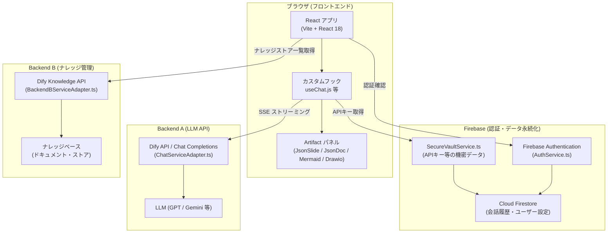
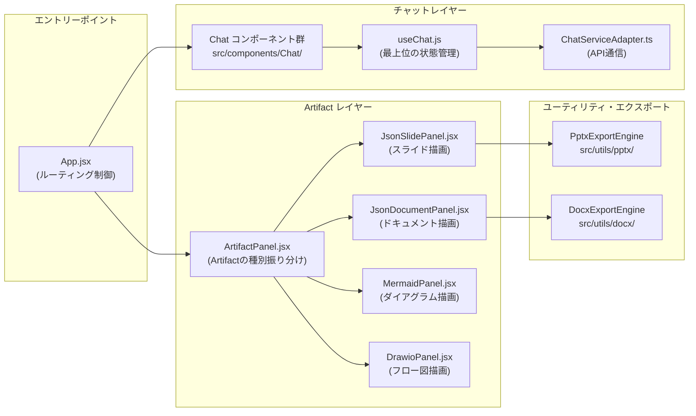
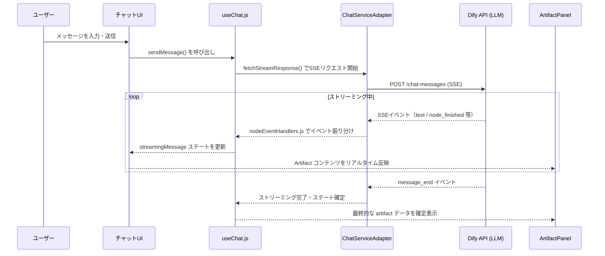
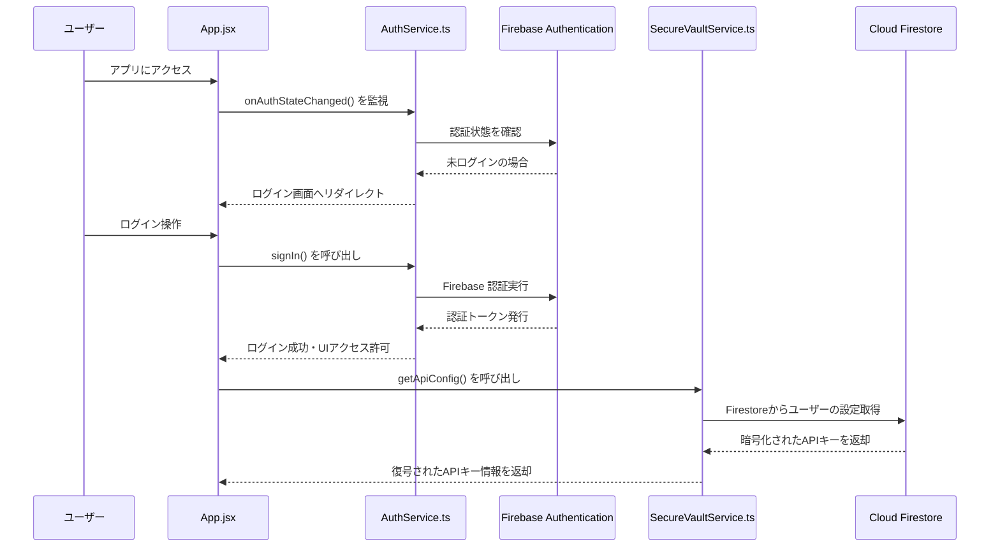

# システムアーキテクチャ図

本ドキュメントでは、フロントエンドアプリケーションのシステム全体構成と、各コンポーネント間の関係を解説します。

---

## 1. 全体アーキテクチャ概要

本アプリケーションは、社内向けAIチャットボット基盤として設計されています。ユーザーはブラウザ上でAIと会話し、その結果をリアルタイムに「Artifact（成果物）」として生成・閲覧・編集・エクスポートすることができます。

---

## 2. フロントエンド内部のコンポーネント関係

---

## 3. 主要コンポーネントの役割一覧

| コンポーネント / サービス | ファイルパス | 役割 |
|---|---|---|
| **App.jsx** | `src/App.jsx` | ルーティング・全体レイアウトの制御 |
| **useChat.js** | `src/hooks/useChat.js` | チャット機能の最上位ステート管理（約60KB） |
| **ChatServiceAdapter** | `src/services/ChatServiceAdapter.ts` | Dify APIへのSSEストリーミングリクエスト処理 |
| **BackendBServiceAdapter** | `src/services/BackendBServiceAdapter.ts` | Backend B（ナレッジ管理）との通信 |
| **AuthService** | `src/services/AuthService.ts` | Firebase Authenticationによる認証管理 |
| **SecureVaultService** | `src/services/SecureVaultService.ts` | Firestoreに暗号化保存されたAPIキーの取得 |
| **DifyClient** | `src/services/DifyClient.ts` | ナレッジストア一覧取得のユーティリティ |
| **ArtifactPanel** | `src/components/Artifacts/ArtifactPanel.jsx` | AIレスポンスのArtifact種別を判定し、適切なパネルへ振り分ける |
| **JsonSlidePanel** | `src/components/Artifacts/JsonSlidePanel.jsx` | プレゼンスライドのメインパネル |
| **JsonDocumentPanel** | `src/components/Artifacts/JsonDocumentPanel.jsx` | ドキュメントのメインパネル |
| **MermaidPanel** | `src/components/Artifacts/MermaidPanel.jsx` | Mermaidダイアグラムのメインパネル |
| **DrawioPanel** | `src/components/Artifacts/DrawioPanel.jsx` | Draw.ioフロー図のメインパネル |

---

## 4. データフロー：AIメッセージからArtifact表示まで

---

## 5. 認証フロー

---

*関連ドキュメント: [02_local-setup.md](./02_local-setup.md) | [../phase2-core-features/05_streaming-chat.md](../phase2-core-features/05_streaming-chat.md)*
