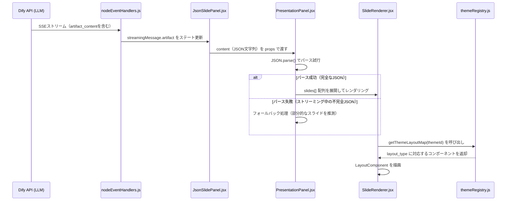

# Artifact機能: JsonSlide（スライド生成）

本ドキュメントでは、AIが構造化JSONデータを出力し、プレゼンテーションスライドとしてリアルタイム描画する「JsonSlide」機能の全仕様を解説します。  
本システムの最大の特徴的機能であり、改修・拡張を行う際は本ドキュメントを熟読してください。

---

## 1. 機能概要

JsonSlide機能は以下の要素で構成されています：

- **データ受信**: AIがSSEストリームでJSONデータを送信
- **パース処理**: ストリーミング中の不完全なJSONにも対応したフォールバック付きパース
- **描画**: テーマシステムを経由したスライドコンポーネントへのレンダリング
- **編集**: スライドフォームエディタによるインライン編集
- **エクスポート**: PPTX形式でのダウンロード

---

## 2. データフローとパース処理

### 2.1 全体フロー（シーケンス図）



### 2.2 JSON文字列のパース処理

`PresentationPanel.jsx` がAIからの `content`（JSON文字列）を受け取り、パースを行います。

```javascript
// PresentationPanel.jsx 内部の処理イメージ
try {
    const parsed = JSON.parse(content);
    // parsed.slides[] が存在すれば正常描画
    setSlides(parsed.slides || []);
} catch (e) {
    // ストリーミング中は不完全なJSONが来るためエラーは無視
    // 既存のslidesステートをそのまま維持する（フォールバック）
}
```

**ストリーミング中の挙動:**
- AIがJSONを少しずつ送信するため、途中では不正なJSON（末尾が切れた状態等）が届く
- `JSON.parse()` の失敗は正常系として扱い、エラーをスローせずに前回の正常状態を維持する
- ストリーム完了後（`message_end` イベント）に最終的な完全JSONがパースされる

---

## 3. コンポーネントツリーと描画フロー

### 3.1 コンポーネント階層

```
JsonSlidePanel.jsx           ← パネルの外枠（ヘッダー・ボタン等）
└── PresentationPanel.jsx    ← スライド一覧・ナビゲーション・編集モード管理
    ├── SlideNavigation.jsx  ← 前ページ/次ページボタン・スライド番号表示
    ├── SlideRenderer.jsx    ← スライド1枚のレンダリング制御（テーマ解決）
    │   └── [LayoutComponent]← themeRegistryから解決された実際のスライドコンポーネント
    └── SlideFormEditor.jsx  ← 編集モード時のフォームエディタ
```

### 3.2 SlideRenderer.jsx の処理内容

`SlideRenderer.jsx` はスライド1枚のレンダリングを担い、テーマシステムとの橋渡し役を果たします。

```javascript
// src/components/Artifacts/JsonSlide/SlideRenderer.jsx
const SlideRenderer = ({ slide, themeId, slideIndex, totalSlides, isStatic }) => {
    // 1. themeRegistry から現在のテーマのレイアウトマップを取得
    const layoutMap = getThemeLayoutMap(themeId);

    // 2. layout_type に一致するコンポーネントを解決（なければ content_slide をフォールバック使用）
    const LayoutComponent = layoutMap[slide.layout_type] || layoutMap['content_slide'];

    // 3. 解決されたコンポーネントを描画
    return (
        <div className="slide-renderer-wrapper" data-slide-id={slide.id}>
            <LayoutComponent content={slide.content || {}} isStatic={isStatic} />
            <div className="slide-page-indicator">
                {slideIndex + 1} / {totalSlides}
            </div>
        </div>
    );
};
```

**重要なポイント:**
- `slide.layout_type` が存在しない、またはテーマに未登録の場合は `content_slide` にフォールバック
- `slide.content` オブジェクトが各スライドコンポーネントに `props` として渡される
- `isStatic=true` を指定するとアニメーションが無効化される（一覧表示・PPTX出力時に使用）

---

## 4. テーマ・レジストリシステム（最重要）

### 4.1 テーマシステムの全体構造

```
src/components/Artifacts/JsonSlide/
├── config/
│   └── themeRegistry.js        ← テーマIDとlayout_mapの登録テーブル
└── themes/
    ├── modern-indigo/           ← Modern Indigoテーマ（推奨・高機能）
    │   ├── index.js             ← layout_type → コンポーネントのマッピング定義
    │   ├── theme.css            ← テーマ固有のCSS変数・スタイル
    │   └── slides/              ← このテーマ専用スライドコンポーネント（20種類以上）
    │       ├── TitleSlide.jsx
    │       ├── ContentSlide.jsx
    │       ├── ChartSlide.jsx
    │       └── ... (全20種)
    └── corporate-modern/        ← Corporate Modernテーマ
        ├── index.js
        ├── theme.css
        └── slides/
```

### 4.2 themeRegistry.js の役割

`themeRegistry.js` はすべてのテーマの登録テーブルです。新しいテーマを追加する際は必ずここに登録します。

```javascript
// src/components/Artifacts/JsonSlide/config/themeRegistry.js

import { corporateModernMap } from '../themes/corporate-modern';
import { modernIndigoMap } from '../themes/modern-indigo';

// テーマID → レイアウトマップ のテーブル
export const themeRegistry = {
    'corporate-modern': corporateModernMap,
    'modern-indigo':    modernIndigoMap,
    // 新テーマ追加時はここに追記
    // 'ocean-blue': oceanBlueMap,
};

// 指定テーマIDのマップ取得（存在しない場合は 'corporate-modern' をフォールバック）
export const getThemeLayoutMap = (themeId) => {
    return themeRegistry[themeId] || themeRegistry['corporate-modern'];
};
```

### 4.3 テーマのレイアウトマップ（modern-indigoの例）

各テーマの `index.js` が、`layout_type` 文字列とReactコンポーネントのマッピングを定義します。

```javascript
// src/components/Artifacts/JsonSlide/themes/modern-indigo/index.js

export const modernIndigoMap = {
    // --- 正式なlayout_typeキー ---
    title_slide:              TitleSlide,
    content_slide:            ContentSlide,       // フォールバック先
    split_slide:              SplitSlide,
    quote_slide:              QuoteSlide,
    section_slide:            SectionSlide,
    table_slide:              TableSlide,
    chart_slide:              ChartSlide,
    stats_slide:              StatsSlide,
    image_content_slide:      ImageContentSlide,
    timeline_slide:           TimelineSlide,
    agenda_slide:             AgendaSlide,
    profile_slide:            ProfileSlide,
    kpi_dashboard_slide:      KpiDashboardSlide,
    process_flow_slide:       ProcessFlowSlide,
    executive_summary_slide:  ExecutiveSummarySlide,
    data_insight_slide:       DataInsightSlide,
    matrix_slide:             MatrixSlide,
    strategic_pillar_slide:   StrategicPillarSlide,
    multi_point_slide:        MultiPointSlide,
    roadmap_slide:            RoadmapSlide,
    swimlane_slide:           SwimlaneSlide,
    system_architecture_slide: SystemArchitectureSlide,
    org_chart_slide:          OrgChartSlide,

    // --- エイリアス（AIの出力揺れを吸収するための別名） ---
    title:    TitleSlide,
    content:  ContentSlide,
    // ... (全エイリアス)
};
```

**なぜエイリアスが必要か?**  
AIが出力する `layout_type` には揺れが発生することがあります（例: `title_slide` vs `title`）。  
エイリアスを定義することで、どちらの形式でも正しくレンダリングできます。

### 4.4 テーマのフォールバック機構

テーマシステムは以下の順序でフォールバックします：

```
1. 指定された themeId のレイアウトマップを取得
         ↓ マップに指定の layout_type がない場合
2. 同テーマの 'content_slide' にフォールバック
         ↓ 指定された themeId が themeRegistry に登録されていない場合
3. 'corporate-modern' テーマの 'content_slide' にフォールバック
```

---

## 5. AIが出力するJSONスキーマ

AIはスライドを以下のJSON構造で出力します：

```json
{
  "title": "プレゼンテーションタイトル",
  "theme": "modern-indigo",
  "slides": [
    {
      "id": "slide-1",
      "layout_type": "title_slide",
      "content": {
        "title": "スライドタイトル",
        "subtitle": "サブタイトル",
        "kicker": "キャッチコピー"
      }
    },
    {
      "id": "slide-2",
      "layout_type": "content_slide",
      "content": {
        "title": "セクションタイトル",
        "bullets": ["ポイント1", "ポイント2", "ポイント3"]
      }
    }
  ]
}
```

---

## 6. スライドタイプ変更とデータ保持（slideTypeMapper.js）

`src/utils/slideTypeMapper.js` は、編集画面でスライドタイプを変更した際のデータ変換ロジックを担います。

### 主な特徴

| 特徴 | 説明 |
|---|---|
| **共通フィールドの維持** | `title`, `subtitle`, `lead`, `speakerNotes` 等はタイプ変更後も引き継がれる |
| **非破壊的なデータ保持** | タイプ固有データは `_preservedData` に退避され、元のタイプに戻した時に復元される |
| **データの変換** | 例: `bullet`から`table`に変更すると、箇条書き各行がテーブルの行に変換される |

### 利用可能なスライドタイプ（`slideTypeMapper.js` より）

| タイプ値 | 表示名 | 主なデータフィールド |
|---|---|---|
| `title` | 表紙 (Title) | `title`, `subtitle`, `kicker` |
| `section` | セクション区切り | `title`, `subtitle` |
| `agenda` | アジェンダ | `items[]` |
| `bullet` | 箇条書き | `bullets[]` |
| `summary` | 要約 | `summaryPoints[]` |
| `two-column` | 2カラム | `left.heading`, `left.bodyPoints[]`, `right.heading`, `right.bodyPoints[]` |
| `table` | テーブル | `headers[]`, `rows[][]` |
| `chart-placeholder` | グラフ | `chartType`, `chartTitle`, `categories[]`, `series[]` |
| `numbered-points` | 番号付き説明 | `points[]` ({number, title, description}) |
| `feature-cards` | 特長カード | `cards[]` ({title, description, iconHint}) |
| `pricing-table` | 料金プラン | `plans[]`, `featureRows[]` |
| `chart-analysis` | グラフ分析 | `charts[]`, `insights[]` |
| `profile-fact-sheet` | 会社概要 | `facts[]`, `profile` |
| `toc-list` | 目次一覧 | `items[]` ({index, label, page}) |

---

## 7. 拡張ガイドライン

### 新しいスライドパターンの追加手順

詳細は [../phase3-extension-guide/02_add-artifact-block.md](../phase3-extension-guide/02_add-artifact-block.md) を参照。  
簡単な手順の概要：

1. **Reactコンポーネントを作成**  
   `src/components/Artifacts/JsonSlide/themes/[テーマ名]/slides/VideoSlide.jsx`

2. **テーマのindex.jsに登録**  
   `modernIndigoMap` に `video_slide: VideoSlide` を追加

3. **PPTXエクスポートに対応させる（任意）**  
   `src/utils/pptx/themes/modern-indigo/slides/` に対応するスライドジェネレーターを追加

4. **CSSを追加（任意）**  
   `themes/modern-indigo/theme.css` または `slides/` 内のコンポーネントでスタイルを定義

---

*関連ドキュメント: [06_export-pptx-docx.md](./06_export-pptx-docx.md) | [../phase3-extension-guide/01_add-slide-theme.md](../phase3-extension-guide/01_add-slide-theme.md)*
