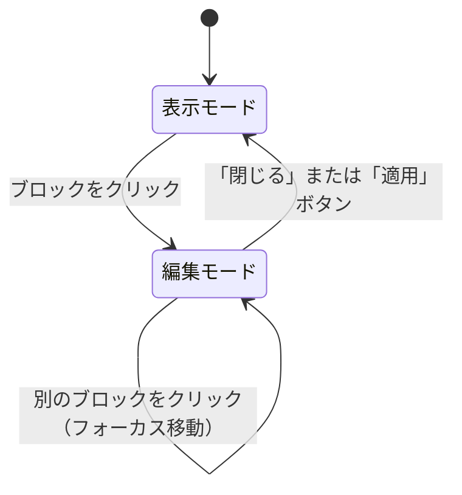
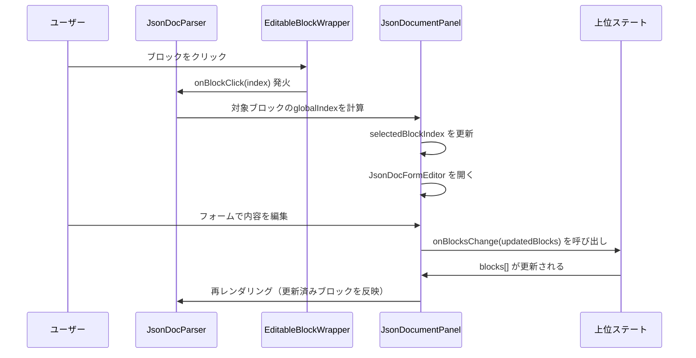

# Artifact機能: JsonDocument（ドキュメント生成）

本ドキュメントでは、AIがJSONデータを元にA4サイズの文書（企画書・レポート等）をブラウザ上でプレビュー表示・編集する「JsonDocument」機能の仕様を解説します。

---

## 1. 機能概要

| 機能 | 説明 |
|---|---|
| **文書描画** | JSONブロックデータをA4サイズにレンダリング |
| **動的ページネーション** | コンテンツの高さを計算してA4ページに自動分割 |
| **インライン編集** | ブロックをクリックして内容を編集可能 |
| **DOCXエクスポート** | Word形式でダウンロード |

---

## 2. パーサーとレンダラーの分離

JsonDocument機能は、責務の分離を徹底した設計になっています。

### 2.1 コンポーネント階層

```
JsonDocumentPanel.jsx           ← パネルの外枠（ヘッダー・エクスポートボタン等）
└── JsonDocRenderer.jsx         ← ページネーション管理・DocPage生成
    ├── usePagination.js        ← A4高さ計算・ページ分割ロジック（カスタムフック）
    └── DocPage[]               ← 各A4ページのコンテナ
        └── JsonDocParser.jsx   ← ブロック種別 → コンポーネントのディスパッチ
            ├── DocCover        ← 表紙ブロック
            ├── DocLetterHeader ← レターヘッダーブロック
            ├── DocTOC          ← 目次ブロック
            ├── DocHeading      ← 見出しブロック
            ├── DocRichText     ← リッチテキストブロック
            ├── DocTable        ← テーブルブロック
            ├── DocList         ← リストブロック
            ├── DocChart        ← グラフブロック
            └── DocSvg          ← SVGブロック
```

### 2.2 JsonDocParser.jsx の役割

`JsonDocParser.jsx` は、ブロック種別と対応するUIコンポーネントのマッピングテーブルを持ちます。

```javascript
// src/components/Artifacts/JsonDocument/JsonDocParser.jsx

// ブロック種別 → コンポーネント のマッピングテーブル
const BLOCK_COMPONENTS = {
    heading:       DocHeading,
    rich_text:     DocRichText,
    table:         DocTable,
    svg:           DocSvg,
    list:          DocList,
    chart:         DocChart,
    toc:           DocTOC,
    cover:         DocCover,
    letter_header: DocLetterHeader,
};

// ブロックを順番に処理してコンポーネントを生成
blocks.map((block, index) => {
    if (block.type === 'page_break') return null; // 改ページは非表示

    const Component = BLOCK_COMPONENTS[block.type];
    if (!Component) {
        // 未知のブロック種別は赤字で警告表示（開発者向け）
        return <div style={{ color: 'red' }}>Unsupported block: {block.type}</div>;
    }

    return (
        <EditableBlockWrapper
            isEditMode={isEditMode}
            isSelected={selectedBlockIndex === index}
            onClick={() => onBlockClick(index)}
        >
            {/* IDはDOCXエクスポート時の画像キャプチャに使用 */}
            <div id={`json-doc-block-${pageIndex}-${index}`}>
                <Component block={block} />
            </div>
        </EditableBlockWrapper>
    );
});
```

**重要な設計ポイント:**
- `id={json-doc-block-${pageIndex}-${index}}` は、DOCXエクスポート時にDOM要素を画像キャプチャするために必要（`captureElementById()`で使用）
- 未知のブロック種別は赤字表示でデバッグを支援する

### 2.3 AIが出力するJSONスキーマ（ドキュメント）

```json
{
  "meta": {
    "title": "ドキュメントタイトル",
    "template": "standard",
    "date": "2026-05",
    "author": "作成者名"
  },
  "blocks": [
    { "type": "heading", "level": 1, "text": "はじめに" },
    { "type": "rich_text", "text": "本文テキスト..." },
    { "type": "table", "headers": ["列1", "列2"], "rows": [["データ1", "データ2"]] },
    { "type": "list", "items": ["項目1", "項目2"] },
    { "type": "chart", "chartType": "bar", "data": { "labels": [], "datasets": [] } },
    { "type": "page_break" }
  ]
}
```

---

## 3. 動的ページネーション処理（usePagination.js）

### 3.1 設計思想

`usePagination.js` は、ブラウザのレンダリングエンジン（`offsetHeight`）ではなく、**独自のブロック高さ推定アルゴリズム**を使用します。

> **なぜoffsetHeightを使わないか?**  
> ストリーミング中（AIがまだデータ送信中）の段階でもページネーションを計算する必要があります。  
> DOMが未レンダリングの状態では `offsetHeight` が取得できないため、推定値ベースの計算を採用しています。

### 3.2 ページ高さの定数

```javascript
// src/components/Artifacts/JsonDocument/utils/usePagination.js
const PAGE_HEIGHT_LIMIT = 960; // A4換算の有効高さ（px）
// 本来のA4高さ = 1123px だが、余白・印刷マージンを考慮して960pxに設定
```

### 3.3 ブロック種別ごとの推定高さ

| ブロック種別 | 推定高さ | 補足 |
|---|---|---|
| `cover` | 960px（1ページ占有） | 必ず1ページ全体を使用 |
| `toc` | 960px（1ページ占有） | 目次は独立ページとして扱う |
| `letter_header` | 380px | レターヘッダーの固定高さ |
| `heading` (level=1) | 100px | H1 |
| `heading` (level>=2) | 80px | H2以下 |
| `rich_text` | `(文字数 / 48) × 26 + 24` | 1行48文字・行高26pxで計算 |
| `rich_text` (装飾variant) | 上記 + 50px | ボックス装飾のパディング分を加算 |
| `table` | `行数 × 44 + 60` | 1行44px + ヘッダー |
| `list` | `項目数 × 32 + 30` | 1項目32px |
| `chart` | 360px | 固定 |
| `svg` | 240px | 固定 |
| `page_break` | 0px | ページ分割マーカー（表示なし） |

### 3.4 改ページの判定ロジック

```
ブロックの種別に応じて以下の判定を行う:

1. page_break ブロック → 無条件に改ページ

2. heading ブロック（孤立防止）
   → 現在の高さ + 見出し高さ + 次のブロック高さ > PAGE_HEIGHT_LIMIT なら改ページ
   ※ 見出しの直後で改ページが発生する「孤立見出し問題」を防ぐ

3. 非分割ブロック（table / svg / chart / 装飾付きrich_text）
   → 現在の高さ + ブロック高さ > PAGE_HEIGHT_LIMIT なら改ページ

4. 分割可能ブロック（通常のrich_text / list）
   → 現在の高さ + ブロック高さ × 0.5 > PAGE_HEIGHT_LIMIT なら改ページ
   ※ 0.5倍を使うことで、より多くのコンテンツを1ページに詰め込む
```

### 3.5 2パス計算によるページ番号と目次の生成

usePaginationは **2パス計算** で構成されています：

**Path 1 (仮計算)**: ページ数と各見出しのページ番号を把握  
↓  
**Path 2 (本計算)**: 目次ページを含む最終的なページ配列を構築

```
finalPages の構造（standardテンプレートの場合）:
  finalPages[0] = [{ type: 'cover', meta }]          ← 表紙（固定）
  finalPages[1] = [{ type: 'toc', entries: [...] }]   ← 目次（固定）
  finalPages[2] = [block, block, ...]                 ← 本文1ページ目
  finalPages[3] = [block, block, ...]                 ← 本文2ページ目
  ...
```

**letterテンプレート（ビジネスレター）の場合:**
```
  finalPages[0] = [{ type: 'letter_header', meta }, block, ...]  ← ヘッダー＋本文
  finalPages[1] = [block, block, ...]                            ← 2ページ目以降
```

---

## 4. インライン編集と状態同期

### 4.1 表示モードと編集モードの切り替え



### 4.2 EditableBlockWrapper.jsx の役割

`EditableBlockWrapper.jsx` は、編集モード時にブロックに選択ハイライトとクリックハンドラを付加するラッパーコンポーネントです。

```
表示モード (isEditMode=false):
  → クリックイベントなし・ハイライトなし・通常表示

編集モード (isEditMode=true):
  → クリック可能・選択時にハイライト枠表示
  → クリックすると onBlockClick(index) が発火
```

### 4.3 データフロー（編集内容の反映）



### 4.4 注意点：グローバルインデックスとローカルインデックスの変換

`JsonDocRenderer.jsx` では、各ページに分散したブロックのインデックス変換が行われています。

- **ローカルインデックス**: そのページ内での位置（0始まり）
- **グローバルインデックス**: `blocks[]` 全体での位置（表紙・目次ブロックを除外した実際のインデックス）

インデックス変換のオフセットは `blockOffset` 変数で管理されており、各ページの開始インデックスの累積値として計算されます。

---

## 5. エラーハンドリングとEdge Cases

| ケース | 挙動 |
|---|---|
| ブロック種別が未登録 | コンソールに警告・赤字で `Unsupported block: {type}` を表示 |
| blocksが空の場合 | `usePagination` が空配列を返し、生成中であれば「ドキュメントを構成中...」スピナーを表示 |
| 巨大な表（多数の行） | 推定高さが `PAGE_HEIGHT_LIMIT` を超える場合でも1ブロックとして扱われる（現在の限界） |
| ストリーミング中のJSON不完全状態 | パネルが「生成中」フラグで制御し、最後のページにタイピングカーソルを表示 |

---

*関連ドキュメント: [06_export-pptx-docx.md](./06_export-pptx-docx.md)*
