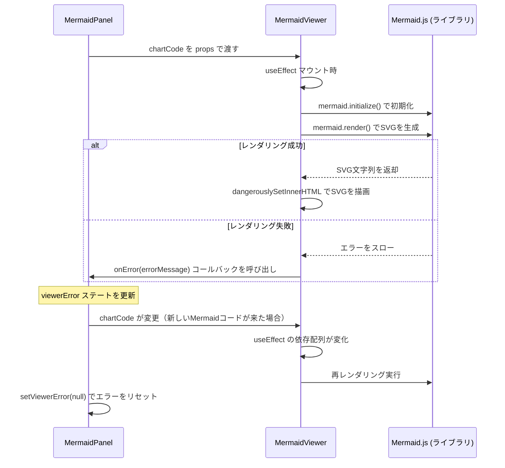
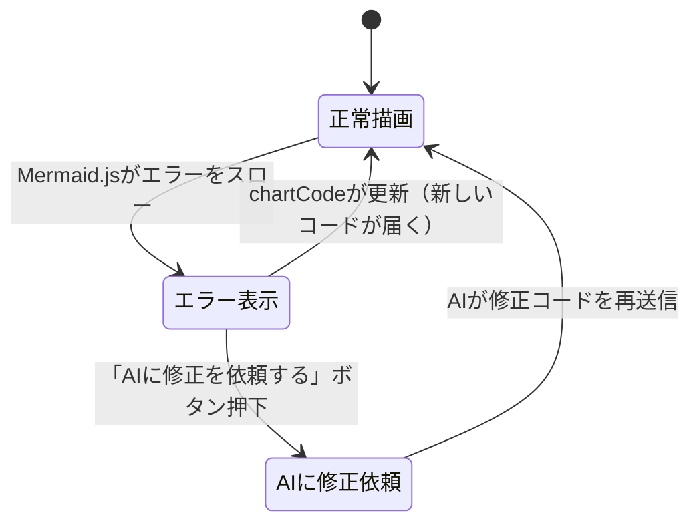

# Artifact機能: MermaidViewer（ダイアグラム生成）

本ドキュメントでは、Mermaid記法を使ってフローチャートやシーケンス図等を描画する「MermaidViewer」機能の仕様を解説します。

---

## 1. 機能概要

| 機能 | 説明 |
|---|---|
| **ダイアグラム描画** | AI出力のMermaidコードをSVGとしてリアルタイム描画 |
| **タイプ自動判定** | ダイアグラム種別を自動判定し、日本語ラベルとアイコンを表示 |
| **ズームコントロール** | Auto Fit + 手動ズーム（30%〜250%） |
| **エラーハンドリング** | Mermaid構文エラーを捕捉してユーザーに表示 |
| **AIによる自動修正** | エラー時に「AIに修正を依頼する」ボタンで自動修正プロンプトを送信 |
| **ダウンロード** | SVG / PNG（3倍解像度）/ Markdown形式でエクスポート |

---

## 2. コンポーネント構成

```
MermaidPanel.jsx       ← パネルの外枠・UI制御（ズーム・エラー表示・ダウンロード）
└── MermaidViewer.jsx  ← Mermaid.jsを使った実際の描画処理
```

### 役割の分担

| コンポーネント | 役割 |
|---|---|
| `MermaidPanel.jsx` | ヘッダーUI・ズームコントロール・エラー表示・ダウンロード処理 |
| `MermaidViewer.jsx` | Mermaid.js の初期化・レンダリング・エラー検知 |

---

## 3. データの抽出とライフサイクル

### 3.1 Mermaidコードの抽出元

Mermaidコードは、AIのレスポンス内の Artifact として受け取ります。  
`artifact_type` が `mermaid_*`（例: `mermaid_flowchart`）のものが対象です。

`MermaidPanel.jsx` では以下のようにコンテンツを取得しています：

```javascript
// ストリーミング中 or 確定済みのコンテンツを取得
const displayContent = streamingArtifact?.artifact_content || artifact?.content || '';
const displayType = streamingArtifact?.artifact_type || artifact?.type || 'mermaid_generic';
```

### 3.2 ダイアグラムタイプの解決

ダイアグラムタイプは **2段階** で解決されます：

```javascript
// MermaidPanel.jsx より
let subType = 'generic';

if (displayType.startsWith('mermaid_')) {
    // 1. artifact_type から直接解決（例: 'mermaid_flowchart' → 'flowchart'）
    subType = displayType.substring(8);
} else {
    // 2. displayType が mermaid_ で始まらない場合は、コード内容から判定
    subType = detectMermaidType(displayContent); // mermaidHelper.js の関数
}
```

### 3.3 MermaidViewer.jsx のマウント・アンマウントライフサイクル



---

## 4. ダイアグラム種別の自動判定（mermaidHelper.js）

### 4.1 detectMermaidType 関数の仕組み

`src/utils/mermaidHelper.js` の `detectMermaidType()` 関数がコードの先頭キーワードを解析します。

```javascript
// src/utils/mermaidHelper.js
export const detectMermaidType = (codeText) => {
    if (!codeText) return 'generic';

    // コメント行（%%で始まる行）と空行を除去して先頭の有効なワードを取得
    const cleanCode = codeText.trim().replace(/^\s*%%[\s\S]*?\n/g, '').trim();
    const firstWord = cleanCode.split(/[\s\(\[\{]/)[0];

    if (firstWord.startsWith('graph') || firstWord.startsWith('flowchart')) return 'flowchart';
    if (firstWord === 'sequenceDiagram') return 'sequence';
    if (firstWord === 'classDiagram')    return 'class';
    if (firstWord.startsWith('stateDiagram')) return 'state';
    if (firstWord === 'erDiagram')       return 'er';
    if (firstWord === 'gantt')           return 'gantt';
    if (firstWord === 'pie')             return 'pie';
    if (firstWord === 'journey')         return 'journey';
    if (firstWord === 'gitGraph')        return 'git';
    if (firstWord === 'mindmap')         return 'mindmap';
    if (firstWord === 'timeline')        return 'timeline';
    if (firstWord === 'requirementDiagram') return 'requirement';
    if (firstWord.startsWith('C4'))     return 'c4';
    if (firstWord === 'architecture-beta') return 'architecture';

    return 'generic'; // 判定できない場合のフォールバック
};
```

### 4.2 サブタイプ → 日本語ラベル・アイコンのマッピング

```javascript
// src/utils/mermaidHelper.js
export const MERMAID_DIAGRAM_MAP = {
    flowchart:    { emoji: '📊', label: '業務フロー図' },
    sequence:     { emoji: '🔄', label: 'シーケンス連携図' },
    class:        { emoji: '🏗️', label: '構造設計図' },
    state:        { emoji: '⚙️', label: '状態遷移図' },
    er:           { emoji: '🗄️', label: 'データベース設計図' },
    gantt:        { emoji: '📅', label: 'プロジェクト工程表' },
    pie:          { emoji: '🍕', label: '割合グラフ' },
    journey:      { emoji: '🗺️', label: 'カスタマージャーニー' },
    git:          { emoji: '🌿', label: '履歴管理図' },
    mindmap:      { emoji: '🧠', label: 'アイデア整理図' },
    timeline:     { emoji: '⏳', label: 'タイムライン表' },
    requirement:  { emoji: '📋', label: '要件定義図' },
    c4:           { emoji: '🏢', label: 'C4モデル設計図' },
    architecture: { emoji: '☁️', label: 'アーキテクチャ構成図' },
    generic:      { emoji: '📊', label: '構成図' },
};
```

---

## 5. クレンジングとエラーハンドリング

### 5.1 サニタイズ処理

`mermaidHelper.js` の `detectMermaidType` はコメント行（`%%`で始まる行）を除去して先頭キーワードを正確に判定します。  
これはLLMが出力するMermaidコードに `%%`形式のコメントが含まれることが多いためです。

### 5.2 Mermaid.jsレンダリングエラーの捕捉

`MermaidViewer.jsx` が Mermaid.js のエラーを捕捉し、`onError` コールバックを通じて `MermaidPanel.jsx` に伝達します。

```javascript
// MermaidViewer.jsx 内の処理イメージ
try {
    const { svg } = await mermaid.render(uniqueId, chartCode);
    containerRef.current.innerHTML = svg; // SVGを表示
} catch (error) {
    onError(error.message || 'レンダリングエラー'); // エラーをパネルに伝達
}
```

### 5.3 エラー発生時のUI



エラー時のUI表示内容：
- エラーバナー（エラータイトル・説明文）
- エラーの詳細メッセージ（`<pre>` タグ）
- 問題のあるソースコード（`<pre>` タグ）
- 「AIに修正を依頼する」ボタン（フッター固定）

### 5.4 「AIに修正を依頼する」の仕組み

エラーが発生した際、`MermaidPanel.jsx` の `handleFixRequest()` 関数が以下の処理を行います：

1. ダイアグラム種別（`subType`）に応じた **文法ルールアドバイス** を `syntaxAdviceMap` から取得
2. エラーメッセージ・文法ルール・問題のあるソースコードを含む修正依頼プロンプトを生成
3. `onSendMessage(promptText)` コールバックで親コンポーネントに送信し、チャットに投稿

この仕組みにより、ユーザーはMermaidの文法を知らなくても、AIが自動的に構文エラーを修正します。

---

## 6. ズームコントロールの仕組み

MermaidPanelは **Auto Fit** 機能を実装しています。

```javascript
// パネル幅を ResizeObserver で監視
useEffect(() => {
    const resizeObserver = new ResizeObserver(entries => {
        setPanelWidth(entry.contentRect.width);
    });
    resizeObserver.observe(panelRef.current);
    return () => resizeObserver.disconnect();
}, []);

// パネル幅から最適なズーム率を計算
useEffect(() => {
    const availableWidth = panelWidth - 48; // 余白を考慮
    const baseWidth = 720;                  // 基準サイズ（px）
    let optimalZoom = Math.floor((availableWidth / baseWidth) * 100);
    let finalZoom = Math.max(30, Math.min(250, optimalZoom + zoomOffset));
    setZoomLevel(finalZoom);
}, [panelWidth, zoomOffset]);
```

- `zoomOffset` が 0 の状態が「Auto Fit」
- ズームIn/Out ボタンで `zoomOffset` を ±10 ずつ調整
- ズームラベルボタンをクリックすると `zoomOffset=0` にリセット（Auto Fit復帰）

---

## 7. ダウンロード機能の実装

| 形式 | 処理概要 |
|---|---|
| **Markdown (.md)** | `` ```mermaid `` コードブロックを含むMarkdownテキストを Blob 化してダウンロード |
| **SVG (.svg)** | `document.querySelector('.mermaid-panel-content svg')` でSVG要素を取得・シリアライズしてダウンロード |
| **PNG (.png)** | SVGを `<canvas>` に3倍解像度で描画してPNG化。CORS対応のためBase64エンコードを経由 |

---

*関連ドキュメント: [01_artifact-json-slide.md](./01_artifact-json-slide.md) | [04_artifact-drawio.md](./04_artifact-drawio.md)*
