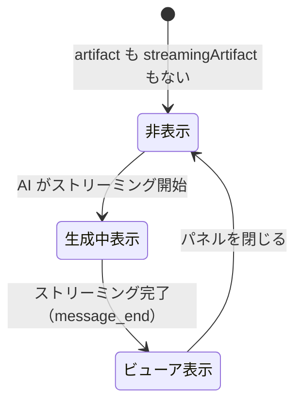

# Artifact機能: DrawioPanel（フロー図生成/連携）

本ドキュメントでは、Draw.io (Diagrams.net) のXMLデータを活用してフロー図を表示する「DrawioPanel」機能の仕様を解説します。

---

## 1. 機能概要

| 機能 | 説明 |
|---|---|
| **フロー図表示** | AIが生成したDraw.io XML形式の図をビューアで表示 |
| **XMLダウンロード** | `.drawio` 形式でファイルをローカル保存 |
| **XMLコピー** | クリップボードにXMLをコピー |

> **重要な設計上の特徴**:  
> 本実装は **Draw.io エディタを埋め込む方式ではなく**、Draw.io の公開ビューアー（`viewer.diagrams.net`）を `<iframe>` で読み込むシンプルな「閲覧専用」アーキテクチャを採用しています。  
> そのため、インライン編集機能（postMessage通信）はありません。ユーザーがXMLをダウンロードし、Draw.io のアプリケーションで別途編集することを想定しています。

---

## 2. 埋め込みアーキテクチャ

### 2.1 コンポーネント構成

`DrawioPanel.jsx` は単一コンポーネントで完結しています（子コンポーネントなし）。

```
DrawioPanel.jsx
├── ヘッダー（タイトル・「Save XML」ボタン・「Copy XML」ボタン・閉じるボタン）
└── <iframe src="https://viewer.diagrams.net/...">
    ← Draw.io 公開ビューアーを iframe で埋め込む
```

### 2.2 iframeのURL構成

```javascript
// DrawioPanel.jsx より
const encodedXml = encodeURIComponent(displayContent); // XMLをURLエンコード
const viewerUrl = `https://viewer.diagrams.net/?lightbox=1&highlight=0000ff&edit=_blank&layers=1&nav=1&title=#R${encodedXml}`;
```

| URLパラメータ | 値 | 意味 |
|---|---|---|
| `lightbox=1` | 1 | ライトボックスモードで表示（シンプルなビューアーUI） |
| `highlight=0000ff` | 0000ff | 選択要素のハイライト色（青） |
| `edit=_blank` | _blank | 「編集」ボタン押下時に新しいタブでエディタを開く |
| `layers=1` | 1 | レイヤーコントロールを表示 |
| `nav=1` | 1 | ナビゲーションパネルを表示 |
| `title` | -(空) | タイトルバーの表示名（未使用） |
| `#R${encodedXml}` | URLエンコードされたXML | 表示するDraw.io XMLデータ本体（フラグメント識別子で渡す） |

### 2.3 表示ロジック

```javascript
// DrawioPanel.jsx より

// ストリーミング中 or 確定済みのコンテンツを取得
const displayContent = streamingArtifact?.artifact_content || artifact?.content || '';

// 生成完了後にのみ iframe を表示（生成中はプレースホルダーを表示）
{displayContent && !isGeneratingArtifact ? (
    <iframe
        src={viewerUrl}
        width="100%"
        height="100%"
        frameBorder="0"
        title={displayTitle}
    />
) : (
    <div>図を生成しています...</div>
)}
```

**なぜ生成中はiframeを表示しないか?**  
- ストリーミング中はXMLが不完全な状態であり、Draw.ioビューアーが正常に解析できない
- XMLが完成してから `iframe.src` を設定することで、確実に正常表示する

---

## 3. XMLダウンロードとコピー

### 3.1 XMLダウンロード（handleDownloadXml）

```javascript
const handleDownloadXml = () => {
    // ファイル名の禁則文字を '_' に置換
    const safeTitle = displayTitle.replace(/[\\/：*?"<>|]/g, '_');

    // Blob を生成してダウンロードリンクを作成
    const blob = new Blob([displayContent], { type: 'application/xml;charset=utf-8' });
    const url = URL.createObjectURL(blob);
    const a = document.createElement('a');
    a.href = url;
    a.download = `${safeTitle}.drawio`; // .drawio 拡張子で保存
    document.body.appendChild(a);
    a.click();
    document.body.removeChild(a);
    URL.revokeObjectURL(url); // メモリリーク防止
};
```

### 3.2 XMLコピー（handleCopy）

```javascript
const handleCopy = async () => {
    await navigator.clipboard.writeText(displayContent);
    setIsCopied(true);
    setTimeout(() => setIsCopied(false), 2000); // 2秒後に「コピー完了」表示を解除
};
```

---

## 4. postMessage通信について（現在の実装との差異）

> **注意**: 現在の実装は `postMessage` による双方向通信を使用していません。

ビューアーモード（`viewer.diagrams.net`）は読み取り専用のため、親ページからのXMLデータの流し込みやエディタ上の変更検知は行いません。

**もし将来的に双方向通信（インライン編集）を実装する場合は以下が必要になります:**

```javascript
// 参考: Draw.ioエディタ埋め込み時のpostMessage通信パターン
// （現在は未実装）

// 親 → 子: XMLデータを流し込む
const initMessage = {
    action: 'load',
    xml: displayContent,
};
iframeRef.current.contentWindow.postMessage(JSON.stringify(initMessage), 'https://embed.diagrams.net');

// 子 → 親: 変更・保存イベントを受け取る
window.addEventListener('message', (event) => {
    if (event.origin !== 'https://embed.diagrams.net') return;
    const data = JSON.parse(event.data);

    if (data.event === 'save') {
        // エディタで保存されたXMLを取得してReactステートに反映
        const editedXml = data.xml;
        setArtifactContent(editedXml);
    }
});
```

---

## 5. ストリーミング中の表示制御



生成中フラグ（`isGeneratingArtifact`）の判定：
```javascript
const isGeneratingArtifact = 
    streamingMessage && 
    streamingMessage.isStreaming && 
    streamingMessage.artifact;
```

---

*関連ドキュメント: [03_artifact-mermaid.md](./03_artifact-mermaid.md) | [05_streaming-chat.md](./05_streaming-chat.md)*
