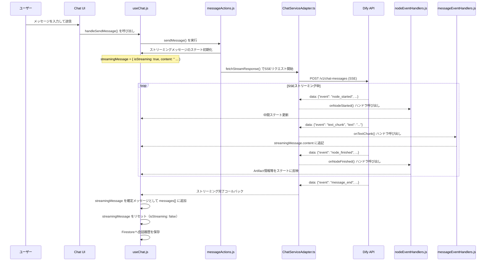
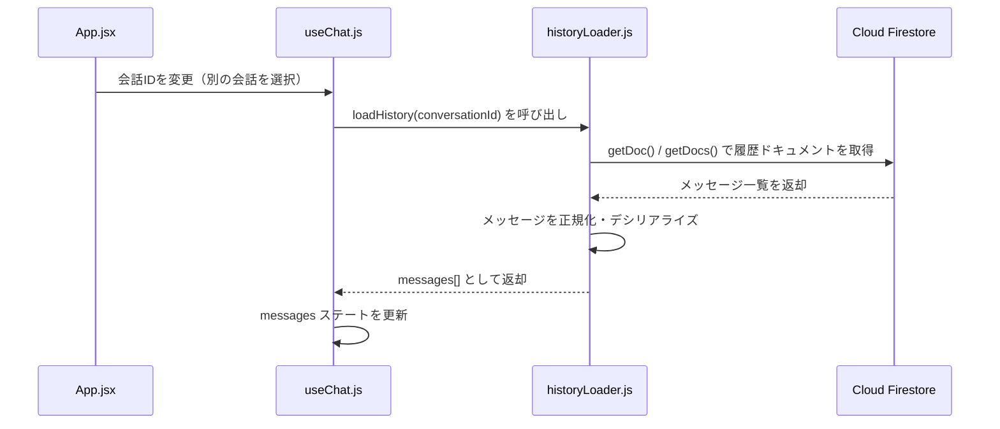

# AIストリーミングチャットと状態管理

本ドキュメントでは、AIとのリアルタイムストリーミングチャットの仕組みと、それを支える状態管理アーキテクチャを解説します。

---

## 1. 概要

本システムのチャット機能は、以下の技術要素で構成されています：

| 要素 | 説明 |
|---|---|
| **SSE（Server-Sent Events）** | サーバーからのリアルタイムストリーミング通信 |
| **useChat.js** | チャット全体の最上位ステート管理（約60KB） |
| **chat/ サブモジュール群** | useChat.js から切り出された責務別のサブモジュール |
| **ChatServiceAdapter.ts** | Dify APIへの通信アダプター |
| **Firebase** | 会話履歴の永続化（Firestore） |

---

## 2. ファイル構成と役割

```
src/hooks/
├── useChat.js                    ← チャットの最上位ステート管理（中枢）
└── chat/
    ├── constants.ts              ← 定数定義（イベント名・ステート初期値等）
    ├── historyLoader.js          ← 会話履歴のFirestoreからの読み込み
    ├── nodeEventHandlers.js      ← Dify SSEイベントの種別別ハンドリング
    ├── messageEventHandlers.js   ← メッセージ単位のイベント処理
    ├── messageActions.js         ← メッセージ操作（送信・削除・再生成等）
    └── perfTracker.js            ← パフォーマンス計測
```

```
src/services/
├── ChatServiceAdapter.ts         ← Dify APIへのSSEストリーミングリクエスト
├── AuthService.ts                ← Firebase認証管理
├── SecureVaultService.ts         ← 機密データ（APIキー）の暗号化・復号
├── BackendBServiceAdapter.ts     ← Backend B（ナレッジ管理）との通信
└── DifyClient.ts                 ← ナレッジストア一覧取得
```

---

## 3. メッセージ送信からストリーミング完了までのフロー



---

## 4. Dify SSEイベントの種類と処理（nodeEventHandlers.js）

Dify APIは複数のSSEイベントを送信します。`nodeEventHandlers.js` がイベント種別ごとに処理を振り分けます。

| イベント名 | 発生タイミング | 主な処理内容 |
|---|---|---|
| `workflow_started` | ワークフロー開始 | ストリーミング開始フラグのセット |
| `node_started` | 各ノード処理開始 | 思考プロセスUI（ThinkingProcess）の更新 |
| `node_finished` | 各ノード処理完了 | Artifact情報の取得・ステート更新 |
| `text_chunk` | AIテキスト生成中 | `streamingMessage.content` への追記 |
| `message_end` | 全処理完了 | ストリーミング終了・メッセージ確定 |
| `message_replace` | メッセージ置換 | 特定ノードのコンテンツ差し替え |
| `error` | エラー発生 | エラーステートの更新・エラーUI表示 |

### Artifact情報の取得タイミング

Artifact（JsonSlide・JsonDocument・Mermaid等）の情報は `node_finished` イベントのペイロードに含まれています。

```javascript
// nodeEventHandlers.js のイメージ
onNodeFinished: (nodeData) => {
    const { outputs } = nodeData;
    if (outputs?.artifact_type && outputs?.artifact_content) {
        // Artifactを検出: streamingMessage.artifact をステート更新
        setStreamingMessage(prev => ({
            ...prev,
            artifact: {
                artifact_type:    outputs.artifact_type,
                artifact_content: outputs.artifact_content,
                artifact_title:   outputs.artifact_title,
            }
        }));
    }
}
```

---

## 5. 会話履歴の読み込み（historyLoader.js）



---

## 6. API通信と認証

### 6.1 ChatServiceAdapter.ts の役割

`ChatServiceAdapter.ts` は Dify API への SSE ストリーミングリクエストを処理する通信アダプターです。

**主な処理内容:**
1. `APIキー` と `APIのベースURL` を受け取り、`/v1/chat-messages` エンドポイントへPOST
2. `Content-Type: text/event-stream` のレスポンスをパース
3. 各SSEイベントを対応するコールバック関数（`onNodeStarted` 等）に振り分け

### 6.2 AuthService.ts（Firebase認証）

`AuthService.ts` は Firebase Authentication を使った認証処理を全般的に管理します。

```
主な機能:
  - ログイン（メール/パスワード・SSO等）
  - ログアウト
  - 認証状態の監視（onAuthStateChanged）
  - ユーザープロフィールの管理
  - 管理者権限の判定
```

### 6.3 SecureVaultService.ts（APIキーのセキュア管理）

`SecureVaultService.ts` は、Firestore に保存された APIキー等の機密データを扱うサービスです。

```
データフロー:
  ユーザーがAPIキーを設定
        ↓
  SecureVaultService が暗号化して Firestore に保存
        ↓
  アプリ起動時・API呼び出し前に
  SecureVaultService が Firestore から取得・復号
        ↓
  ChatServiceAdapter に APIキーを渡す
```

**なぜSecureVaultが必要か?**  
APIキーをフロントエンドのコード（環境変数）に直接記載するとセキュリティリスクがあります。  
Firestoreのセキュリティルールで認証済みユーザーのみがアクセスできるように制限することで、セキュアに管理しています。

---

## 7. useChat.js の主要ステート

```javascript
// useChat.js の管理する主なステート（概要）
{
    messages: [],           // 確定済みのメッセージ一覧
    streamingMessage: null, // ストリーミング中のメッセージ（AIの応答）
    isStreaming: false,      // ストリーミング中かどうか
    conversationId: null,   // 現在の会話ID
    isLoading: false,       // 履歴読み込み中かどうか
    error: null,            // エラー情報
}
```

`streamingMessage` の構造（ストリーミング中に段階的に更新される）：

```javascript
streamingMessage: {
    id: 'msg-xxx',
    role: 'assistant',
    content: '回答テキスト（逐次追記される）',
    isStreaming: true,
    artifact: {             // Artifactが生成される場合のみ存在
        artifact_type:    'json_slide' | 'json_document' | 'mermaid_*' | 'drawio',
        artifact_content: '...',
        artifact_title:   '...',
    },
    thinkingProcess: [],    // AI思考プロセスの中間ステータス
}
```

---

*関連ドキュメント: [01_artifact-json-slide.md](./01_artifact-json-slide.md) | [../phase1-environment/01_system-architecture.md](../phase1-environment/01_system-architecture.md)*
