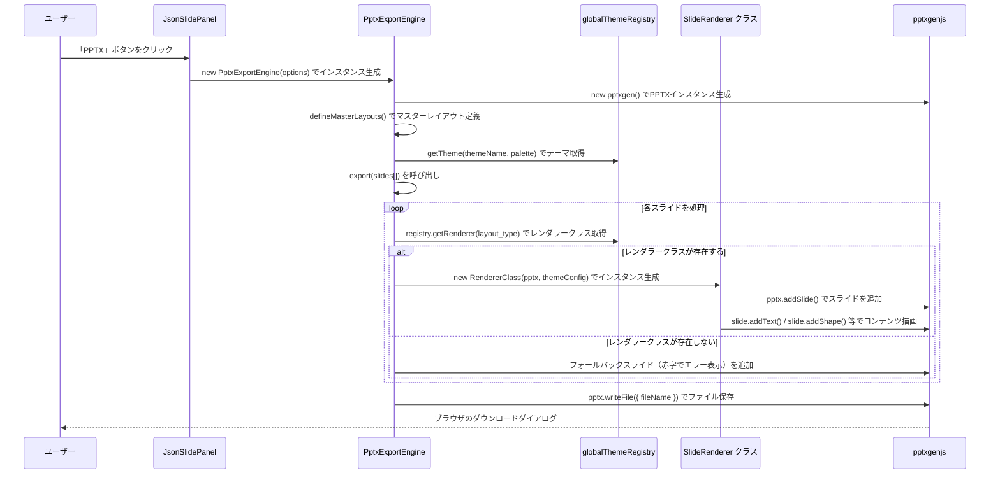
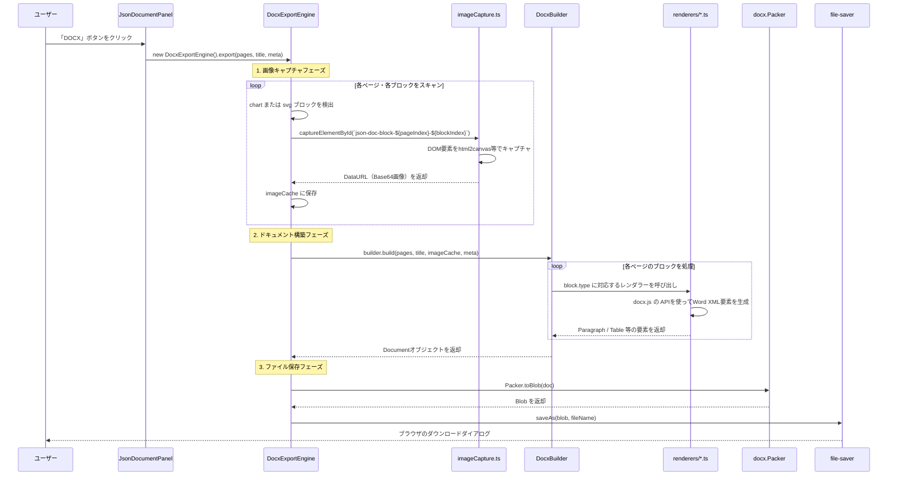

# クライアントサイド・エクスポート機能（PPTX / DOCX）

本ドキュメントでは、ブラウザ上でレンダリングされたArtifactをPowerPoint（PPTX）やWord（DOCX）形式でダウンロードする仕組みを解説します。

---

## 1. 概要と使用ライブラリ

| エクスポート形式 | 主要ライブラリ | 処理場所 |
|---|---|---|
| PPTX | `pptxgenjs` | `src/utils/pptx/` |
| DOCX | `docx` + `file-saver` | `src/utils/docx/` |

**処理の特徴:**  
いずれもブラウザ上（クライアントサイド）で完結します。サーバーへのアップロードなしでファイルを生成・ダウンロードします。

---

## 2. PPTXエクスポート（src/utils/pptx/）

### 2.1 ディレクトリ構成

```
src/utils/pptx/
├── engine.ts              ← エクスポートの全体制御エンジン（エントリーポイント）
├── types.ts               ← TypeScript型定義（ExportOptions, SlideData等）
├── core/                  ← テーマ共通の基盤クラス群
│   ├── Registry.ts        ← スライドタイプ → レンダラークラスの登録テーブル
│   ├── BaseRenderer.ts    ← 各スライドレンダラーの基底クラス（共通処理を定義）
│   ├── TextProcessor.ts   ← テキスト整形・フォント設定のユーティリティ
│   └── UIComponents.ts    ← 共通UIパーツ（罫線・背景図形等）の描画ヘルパー
└── themes/
    └── modern-indigo/     ← Modern Indigoテーマ専用の実装
        ├── config.ts      ← テーマカラー・フォントサイズ等の設定値
        ├── palette.ts     ← カラーパレットの定義
        ├── index.ts       ← テーマのエクスポート（グローバルレジストリへの登録）
        └── slides/        ← スライド種別ごとのPPTX生成クラス
```

### 2.2 エクスポート処理の全体フロー



### 2.3 PptxExportEngine の実装（engine.ts）

```typescript
// src/utils/pptx/engine.ts

export class PptxExportEngine {
  constructor(options: ExportOptions) {
    this.options = options;
    // テーマを取得（未対応テーマの場合はエラーをスロー）
    const theme = globalThemeRegistry.getTheme(options.themeName, options.palette);
    if (!theme) {
      throw new Error(`対象外テーマエラー: 「${options.themeName}」はエクスポートに対応していません。`);
    }

    this.pptx = new pptxgen();
    this.pptx.layout = 'LAYOUT_16x9'; // 16:9 スライドサイズ

    // マスターレイアウトを定義（背景色等をテーマ設定から取得）
    this.defineMasterLayouts(theme.config);
  }

  private defineMasterLayouts(config) {
    // 通常コンテンツ用マスター
    this.pptx.defineSlideMaster({
      title: 'MASTER_MODERN_INDIGO_CONTENT',
      background: { color: config.colors.bg.main }
    });
    // タイトルスライド用マスター（プライマリカラー背景）
    this.pptx.defineSlideMaster({
      title: 'MASTER_MODERN_INDIGO_TITLE',
      background: { color: config.colors.primary }
    });
    // セクション区切り用マスター（ダーク背景）
    this.pptx.defineSlideMaster({
      title: 'MASTER_MODERN_INDIGO_DARK',
      background: { color: config.colors.bg.dark }
    });
  }
}
```

### 2.4 core/Registry.ts の役割

`Registry.ts` は、スライドタイプ（文字列）とレンダラークラスのマッピングを管理します。

```typescript
// src/utils/pptx/core/Registry.ts のイメージ
export class SlideRegistry {
    private renderers: Map<string, typeof BaseRenderer> = new Map();

    register(type: string, rendererClass: typeof BaseRenderer) {
        this.renderers.set(type, rendererClass);
    }

    getRenderer(type: string): typeof BaseRenderer | undefined {
        return this.renderers.get(type);
    }
}
```

### 2.5 core/BaseRenderer.ts の役割

すべてのスライドレンダラーが継承する基底クラスです。

```typescript
// src/utils/pptx/core/BaseRenderer.ts のイメージ
export abstract class BaseRenderer {
    protected pptx: pptxgen;
    protected config: ThemeConfig; // テーマ設定（色・フォントサイズ等）

    constructor(pptx: pptxgen, config: ThemeConfig) {
        this.pptx = pptx;
        this.config = config;
    }

    // 各スライド種別のレンダラーがこのメソッドをオーバーライドする
    abstract render(slideData: SlideData, slideIndex: number): Promise<void>;

    // 共通ユーティリティ（フォント設定・テキスト整形等）
    protected formatText(text: string): pptxgen.TextProps { ... }
}
```

> [!WARNING]
> **PPTXの各スライド描画は「地道な手作業」になります**  
> `pptxgenjs` を使ったスライド生成は、ReactのDOMレンダリング（HTML/CSS）とは全く異なります。
> 新しいスライドタイプを作成・対応させる際は、テキストボックス、図形、画像の「X座標・Y座標・幅・高さ・フォントサイズ・色」などをすべて絶対値またはパーセンテージで、コード上で地道に計算・指定する「職人作業（制作）」が必要になります。CSSのFlexboxのような自動配置は効かない点に強く注意してください。

---

## 3. DOCXエクスポート（src/utils/docx/）

### 3.1 ディレクトリ構成

```
src/utils/docx/
├── engine.ts              ← エクスポートの全体制御エンジン（エントリーポイント）
├── builder.ts             ← Wordドキュメントの構造を組み立てるクラス
├── imageCapture.ts        ← DOM要素を画像としてキャプチャするユーティリティ
├── types.ts               ← TypeScript型定義
└── renderers/             ← ブロック種別ごとのWordレンダラー
    ├── index.ts           ← 全レンダラーのエクスポート集約
    ├── cover.ts           ← 表紙ブロックのWord XML生成
    ├── heading.ts         ← 見出しブロックのWord XML生成
    ├── text.ts            ← テキストブロックのWord XML生成
    ├── table.ts           ← テーブルブロックのWord XML生成
    ├── list.ts            ← リストブロックのWord XML生成
    ├── toc.ts             ← 目次ブロックのWord XML生成
    ├── letterHeader.ts    ← レターヘッダーブロックのWord XML生成
    ├── imageBlock.ts      ← 画像（chart/svg）ブロックのWord XML生成
    └── ...
```

### 3.2 エクスポート処理の全体フロー



### 3.3 画像キャプチャの仕組み（imageCapture.ts）

`chart` / `svg` ブロックはテキストベースのWordでは直接表現できないため、DOM要素を画像としてキャプチャしてWordに埋め込みます。

```typescript
// src/utils/docx/imageCapture.ts のイメージ
export const captureElementById = async (elementId: string): Promise<string | null> => {
    const element = document.getElementById(elementId);
    if (!element) return null;

    // html2canvas 等を使ってDOM要素をキャプチャ
    const canvas = await html2canvas(element);
    return canvas.toDataURL('image/png'); // Base64 DataURL として返却
};
```

`json-doc-block-${pageIndex}-${blockIndex}` という ID は、`JsonDocParser.jsx` 内でブロックに付与されており、エクスポートエンジンとの対応が保証されています。

### 3.4 renderers/の各スクリプトの役割

| ファイル | 対応ブロックタイプ | 主な出力 |
|---|---|---|
| `cover.ts` | `cover` | 表紙ページ（タイトル・メタ情報） |
| `heading.ts` | `heading` | Word見出しスタイル（H1/H2/H3） |
| `text.ts` | `rich_text` | Word段落・テキストスタイル（太字・斜体・リンク等） |
| `table.ts` | `table` | Wordテーブル（ヘッダー行・セルのスタイリング） |
| `list.ts` | `list` | Word箇条書き・番号付きリスト |
| `toc.ts` | `toc` | 目次ページ |
| `letterHeader.ts` | `letter_header` | ビジネスレターのヘッダー |
| `imageBlock.ts` | `chart` / `svg` | キャプチャ済み画像をWordに埋め込む |

---

## 4. エラーハンドリング

| エラーケース | 挙動 |
|---|---|
| 未対応のテーマ（PPTX） | `PptxExportEngine` のコンストラクタでエラーをスロー。UIに「未対応テーマ」エラーを表示 |
| 未対応のスライドタイプ（PPTX） | フォールバックスライド（赤字エラー表示）として出力 |
| DOM要素のキャプチャ失敗（DOCX） | コンソール警告を出力し、該当ブロックをスキップ |
| DOCX全体の構築エラー | `console.error` で記録し、エラーをre-throwしてUIに通知 |

---

*関連ドキュメント: [01_artifact-json-slide.md](./01_artifact-json-slide.md) | [02_artifact-json-document.md](./02_artifact-json-document.md)*
