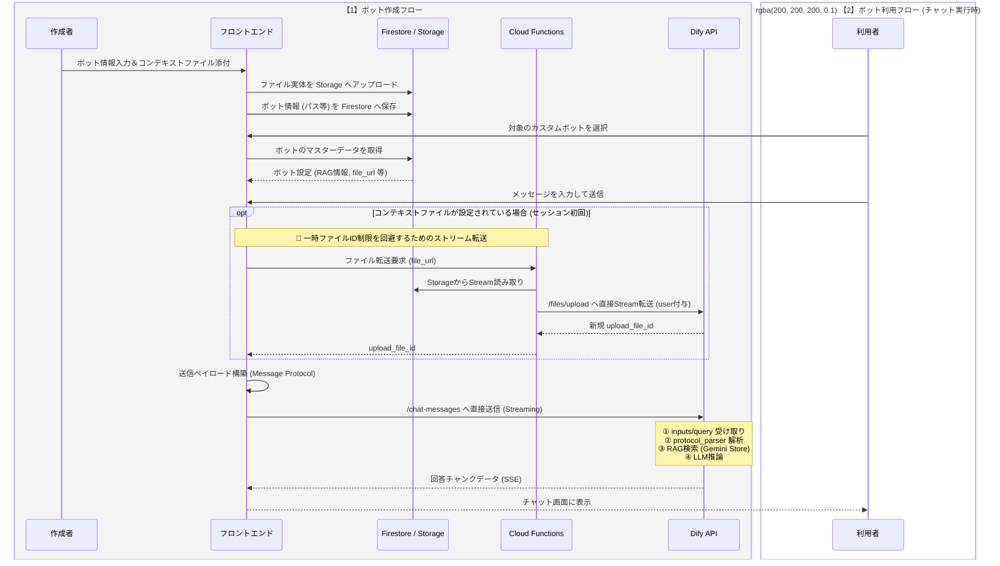

# カスタムボット機能（Custom Bots） 詳細設計および実装計画書

## 1. 機能概要とビジネス要件

### 1.1. カスタムボットとは

「カスタムボット」は、特定の業務タスクや部署特有の文脈に特化したAIアシスタントを、プログラミング知識なし（ノーコード）でユーザー自身が作成し、組織内で共有できる機能です。
AIに対して「あなたは〇〇です。××のように振る舞い、△△のルールに従って回答してください」という**システムプロンプト**と、社内規程や過去の事例などの独自ナレッジ（RAG）をパッケージ化し、いつでも呼び出せる状態にします。

### 1.2. 解決する課題

- **プロンプトエンジニアリングの属人化**: 優秀なプロンプトを「ボット」として共有することで、全社的なAIリテラシーの底上げを図ります。
- **入力手間の削減**: 毎回設定を入力する手間を省き、ワンクリックで最適なAI環境をセットアップします。
- **ナレッジのサイロ化防止**: 部署内に眠っているドキュメントをボットの知識（コンテキスト）として組み込み、AIによる自己解決を促進します。

## 2. 具体的なユースケースと提供価値

本機能を実装することで、以下のような業務改善が期待できます。段階的な実装ステップ（RAGのみ → 添付ファイル対応）に合わせて、幅広い業務に対応可能です。

- **ユースケース1：【全社】社内規程お問合せボット（RAGのみの活用例）**
    - **設定**: 総務・人事部が「就業規則」や「経費精算ルール」を事前定義RAG（Gemini File Search Store）としてすべて読み込ませたボットを作成し、「全社ボット」として公開。
    - **利用**: 社員がチャットで「副業の申請方法は？」と聞くと、最新の規程に基づき、該当ページの引用（サイテーション）付きでAIが回答します。
- **ユースケース2：【法務部】契約書リーガルチェックボット（RAG＋一時ファイルの活用例）**
    - **設定**: 「自社の標準契約書フォーマット」を事前定義RAGとして読み込ませ、厳格な法務担当としてのプロンプトを設定。
    - **利用**: 営業部が顧客からの契約書（一時ファイル）をチャットに添付すると、事前設定されたRAG（自社の基準）と添付された一時ファイルを突き合わせ、AIがリスクを自動チェックし修正案を提示します。
- **ユースケース3：【営業部】提案書ドラフト作成ボット（プロンプト共有の活用例）**
    - **設定**: トップセールスが「刺さる提案書を生成するプロンプト」をボット化。
    - **利用**: 新人が顧客のヒアリングメモ（テキスト）を投げるだけで、トップセールスと同等のクオリティの提案書構成案を出力できます。

## 3. UI/UX 画面設計詳細

### 3.1. スタジオ（ボット一覧）画面

- **3つのスコープタブ**: `マイボット`, `〇〇部ボット`, `全社ボット`
- **ボットカード**: アイコン、ボット名、説明文、作成者名。お気に入り（ピン留め）ボタン。
- **新規作成アクション**: 「＋ 新しいボットを作成」ボタン。

### 3.2. カスタムボット作成・編集モーダル

- **基本情報**: ボット名、説明文、アイコン。
- **振る舞い（プロンプト）**: システムプロンプト入力エリア。
- **知識（RAG / ファイル添付）**: ボットに事前定義したいPDFやドキュメントをアップロードするエリア（ここでアップロードされたファイルはGeminiのStore化、またはStorageに保存され後述のストリーム転送に利用されます）。
- **共有設定**: `非公開（自分のみ）`, `部署内に共有`, `全社に公開`。

### 3.3. チャット画面への統合

- **ヘッダー表示**: 現在会話しているボット名を明示。
- **切り替え**: チャット入力欄からボットの切り替えや汎用モードへの解除をシームレスに行うUI。

## 4. システムアーキテクチャとデータ構造

### 4.1. ユーザー認証と権限管理 (Firebase Custom Claims)

- Firebase Authのカスタムクレームに `department_id` を付与。
- Firestoreへの無駄なReadを発生させず、セキュリティルールで「自分の部署のボットだけ読み書きできる」制御を実現。

### 4.2. データモデル設計 (Firestore / マスターデータ)

コレクション名: `custom_bots`

```
{
  "bot_id": "bot_xyz_789",
  "name": "営業提案書チェッカー",
  "description": "提案書の構成をチェックします",
  "system_prompt": "あなたは優秀な営業コンサルタントです...",
  "creator_uid": "user_uid_001",
  "department_id": "dept_sales",
  "visibility": "department",
  "rag_config": {
    "enabled": true,
    "target_store_id": "corpora/1234567890",
    "target_store_name": "corp_sales_rules_2026"
  },
  "context_file_url": "gs://my-app-bucket/custom_bots/bot_xyz_789/context.pdf",
  "created_at": "2026-06-03T10:00:00Z"
}
```

*(※LocalStorageにはお気に入り情報やUI状態のみを保存する)*

## 5. AI連携プロトコルとファイルハンドリング詳細

Dify上にボットごとにアプリを作成せず、特定のボットに依存しない1つの「汎用チャットフロー」を構築します。
**【重要：セキュリティと将来の展望】現状は機密性の高い情報を取り扱っていないため、初期リリースにおいてはフロントエンドから直接Dify API（`/chat-messages`）と通信するアーキテクチャ（APIキーをクライアントで保持）を採用します。これは将来的にCloud Functions等を経由するプロキシ構成へ移行する前提の暫定措置（将来対応）とします。**

### 5.1. Difyワークフローの構造と事前定義RAG連携

特定のボットに依存しない汎用的なチャットフロー（Chatflow）をDify上に構築し、フロントエンドから流し込まれるパラメータに応じて動的に振る舞いを切り替えます。

- **用途**: 部署の恒久的なナレッジ（就業規則、マニュアル等）の事前定義、および指定されたプロンプトによる振る舞いの制御。
- **事前準備（ボット作成時）**:
    1. 作成者がコンテキストファイルをアップロードし、Gemini Storeを構築する。
    2. 発行された `target_store_id` および `target_store_name` を Firestore の `rag_config` に保存する。
- **Dify側のノード構成**:
    - **開始ノード**: 変数として `system_prompt`, `gemini_store_id`, `gemini_store_name` を受け付ける。
    - **`protocol_parser` ノード (JSON解析)**: 後述の送信ペイロードにおける `query` 内のJSONをパースし、テキストやボットコンテキストを後続ノードへ渡す。
    - **RAG検索ノード (`gemini_file_search` プラグイン)**: 入力変数から渡された `gemini_store_name` を検索対象として指定し、ユーザーの質問に対する検索を実行。恒久的なナレッジを引き出す。
    - **LLMノード**: `system_prompt` と、RAGからの検索結果、さらに（ある場合は）後述の一時添付ファイルの内容を統合して、最終的な推論・回答生成を行う。

### 5.2. 通信ペイロード (Message Protocol)

Difyワークフロー内の開始ノード環境変数（`inputs`）と `protocol_parser` ノードの両方で情報を活用するため、以下のペイロード構造でフロントエンドから直接 Dify API (`/chat-messages`) へ送信します。

```
// フロントエンドから Dify API (/chat-messages) へ直接送信するPOSTペイロード
const payload = {
  // ① Difyの開始ノードで受け取るシステム変数
  inputs: {
    system_prompt: customBot.system_prompt,
    gemini_store_id: customBot.rag_config.target_store_id,
    gemini_store_name: customBot.rag_config.target_store_name
  },
  // ② protocol_parserノードで解析させるためのJSON文字列化されたquery
  query: JSON.stringify({
    text: userInputText,
    bot_context: {
      store_id: customBot.rag_config.target_store_id,
      store_name: customBot.rag_config.target_store_name
    }
  }),
  response_mode: "streaming",
  conversation_id: currentConversationId,
  // ③ ユーザー手動添付、もしくは後述のストリーム転送で取得したファイルID
  files: [
    {
      "type": "document",
      "transfer_method": "local_file",
      "upload_file_id": resolvedFileId
    }
  ],
  user: currentUser.uid
};
```

### 5.3. 一時ファイルストリーム転送アーキテクチャ（Dify一時ファイル制限の突破）

RAG（Gemini Store）ではなく、コンテキストとしての「ファイル実体」をボット作成時に定義した場合、作成者以外の利用者がチャットで利用できるようにするための仕組みです。
Difyの一時ファイルIDはセッション（会話）ごとにリセットされるため、`/chat-messages` は直接通信であっても、**ファイル転送に関しては引き続き Cloud Functions を経由させる**必要があります。

1. **【保存時】**: ボット作成時、一時ファイルとしてのコンテキスト実体はFirebase Storageに保存し、Firestoreにはパス (`gs://...`) を保存。
2. **【利用時】**: ユーザーがボットの新規チャットを開始する直前、フロントエンドは Cloud Functions のファイル転送APIをコール。
3. **【横流し処理】**: Functionsは、StorageからReadable Streamを読み込み、メモリ上で `multipart/form-data` を構築。**この時、必ず `user` フィールドに呼び出し元のFirebase Auth UIDをセット**して Dify の `/files/upload` API へパイプ転送する。
4. **【ID取得と送信】**: Difyから返却された新規セッション専用のID（例: `uuid`）をフロントエンドが `upload_file_id` として受け取り、上記の `/chat-messages` ペイロードの `files` 配列にセットして送信する。

### 5.4. 全体処理フロー（シーケンス図）

ボットの作成から、別の利用者がそれを利用するまでの一連のシステム間連携を表したシーケンス図です。



## 6. 実装・引き継ぎ計画（モック駆動開発）

本機能はシステム間の連携（Firebase ↔ フロントエンド ↔ Dify）が複雑であるため、**藤井がフロントエンド上でバックエンドの挙動をモック（擬似）化して仕様を確定させた後、村上がそれを本物のバックエンド実装に置き換えていく段階的アプローチ**を採用します。

### Phase 1: フロントエンドモック構築と仕様確定（担当：藤井）

藤井はローカル環境でUIを作成し、将来バックエンド（FirestoreやFunctions）が担う処理をフロントエンド内の「モック関数」として実装します。これにより、バックエンドに要求するインターフェース（APIの形）を明確にします。

- **タスク1: UI構築とモック関数の定義**
    - 「スタジオ画面」「作成モーダル」「チャット画面」のUIを作成。
    - `createCustomBot(data)`, `fetchCustomBots()`, `uploadToStorageAndGetUrl(file)` などのバックエンド通信をシミュレートするモック関数を作成し、フロントエンドの状態管理を完成させる。
- **タスク2: Difyチャットフローの構築と疎通**
    - Dify上で本番用の汎用Chatflowを作成（`protocol_parser`、`gemini_file_search` 配置）。
    - フロントエンドからモックデータを使い、直接Dify API (`/chat-messages`) へペイロードを投げて正常に動作するか確認する。
- **タスク3: 引き継ぎ書の作成**
    - モック作成を通じて確定した「Firestoreのデータ構造」と「Cloud Functionsに期待するリクエスト/レスポンス形式」を整理し、村上への引き継ぎ仕様書としてまとめる。

### Phase 2: バックエンド基盤の実装と結合（担当：村上）

藤井から仕様を引き継いだ後、村上は難易度の低い順に段階的な開発（Step 1 → Step 2 → Step 3）を行います。各ステップ完了ごとに藤井のモック実装を本物に置き換え、テストを行います。

### Step 1: 基盤構築とシステムプロンプトのみの実装（コンテキストなし）

RAGやファイル転送などの外部連携は後回しにし、まずは基本的なデータベース保存とシステムプロンプトによるプロンプトエンジニアリング機能が動く状態を作ります。

- **タスク4: Firebase基盤の構築**
    - Firestoreの `custom_bots` コレクションとセキュリティルールを設定。
    - Cloud Functionsで、アカウントに `department_id` を付与するCustom Claimsロジックを実装。
- **タスク5: モックからの切り替え（基本設定のみ）**
    - 藤井が作成したUIのモック関数（保存・取得）を、Firestoreへの実際のCRUD処理に置き換える。
    - **【結合テスト1】**: コンテキスト（RAG、ファイル）を持たず、システムプロンプトのみを設定したボットを作成し、チャット画面で意図した振る舞い（プロンプト制御）が機能するかを共同で確認する。

### Step 2: RAG（事前定義ナレッジ）連携の実装

Step 1の基盤に、Gemini Storeを用いた恒久的なナレッジ（RAG）との連携を追加します。

- **タスク6: RAG情報の保存・取得とDify連携**
    - ボット作成時にGemini Store ID/NameをFirestoreに保存する処理を結合する。
    - **【結合テスト2】**: 事前定義RAGの設定を持たせたボットを作成し、チャット画面からDifyへ適切なパラメータが渡り、RAG検索が機能するかを共同で確認する。

### Step 3: 一時添付ファイルとストリーム転送の実装

Step 2までの基盤の上に、最も複雑なファイルストリーム転送の仕組みを追加します。

- **タスク7: ファイル転送 Functions の実装**
    - Firebase Storage から Dify `/files/upload` へのストリーム横流しAPIを構築する。
    - ※引き継ぎ書の仕様に基づき、`multipart/form-data` の構築と `user` パラメータの付与を必ず行うこと。
- **タスク8: モックからの切り替え（ファイル処理）**
    - 藤井のファイル処理モックを、「Storageへの実体アップロード」および「タスク7のFunctions呼び出し」に置き換える。
    - **【結合テスト3】**: 作成者がセットしたコンテキストファイルが、利用者のチャット開始時にFunctionsを経由してDifyへ転送され、エラー無く推論に利用されるかを共同で確認する。手動添付ファイルについても同様に検証する。