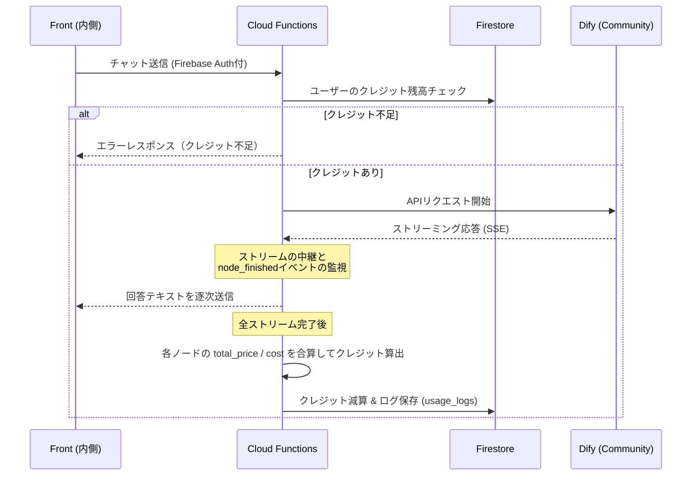

# 社内AIエージェント クレジット管理システム 概要案

## 1. プロジェクトの目的と背景

Dify Community版を利用した社内AIエージェントにおいて、各AIモデル（Gemini, GPTなど）および外部ツール（Perplexity, Web検索など）の利用コストを精緻に可視化し、予算超過を防ぐための「クレジット（以下、略称として **CR** を使用する場合があります）管理機能」を構築する。

**採用アプローチ:** 外部のLLMOpsツール（Langfuse等）は導入せず、**Dify本体や各ツールが出力するJSON内の「価格情報 (`total_price` / `total_cost`)」を直接中継サーバーで合算する手法**を採用する。これにより、インフラ管理コストを抑えつつ、利用モデルの差異（上位/下位モデル、入力/出力トークン単価の違い）を自動的かつ正確にクレジットに反映させる。

## 2. システムアーキテクチャ

### 2.1 構成要素

- **Frontend (React - 内側):** チャットUI。残りクレジットの表示と、不足時のエラーハンドリングを担う。
- **Frontend (React - 外側):** ログイン基盤と管理者向けポータル。「クレジット付与・分析ダッシュボード」を提供する。
- **Backend (Firebase Cloud Functions):** Difyへのリクエスト中継（プロキシ）、ストリーミングイベントのパース、クレジットの計算とFirestoreの更新を担う。
- **Database (Firestore):** ユーザーごとのクレジット残高、および利用履歴（ログ）を保存する。
- **LLM Engine (Dify Community Edition):** プロンプト処理、ルーティング、ツール実行を担当。

### 2.2 処理シーケンス



## 3. クレジットの算出ロジック

### 3.1 価格情報からの直接換算

Difyの各ノード（LLM）終了時や、ツール実行時に出力されるUSDベースの価格情報に、社内固定レートを掛けてクレジットを算出する。モデルごとの単価の違いはDify側が計算するため、バックエンド側での複雑な条件分岐は不要となる。

- **換算レート（例）:** `1 USD = 10,000 クレジット (CR)`
- **計算式:**
    - DifyネイティブのLLMノード: `usage.total_price * 10,000`
    - Perplexity等の対応ツール: `usage.cost.total_cost * 10,000`

### 3.2 価格が出力されないノードのフォールバック（固定クレジット）

RAG（Geminiファイル検索）など、出力JSONに価格情報が含まれない、または `0.00` となるツールについては、「実行1回あたりの固定クレジット」をバックエンド側で設定する。

- **例:** * 社内ドキュメント検索（RAG）ノード実行: **+ 50 クレジット**
    - 社内DB参照ノード実行: **+ 10 クレジット**

## 4. データモデル (Firestore)

### 4.1 `users` コレクション

既存の認証基盤仕様（Firebase Auth カスタムクレーム同期）に則り、既存の `users` ドキュメントに対して今回新規でクレジット管理用の2フィールド（`credit_balance`, `credit_limit`）を追加・拡張する。

```
{
  "user_id": "user_123",       // Firebase Authのuidと一致
  "displayName": "山田 太郎",  // Auth標準属性
  "email": "taro@company.com", // Auth標準属性
  "department": "営業部",      // カスタムクレームと同期
  "role": "general",           // user_roles/カスタムクレームと同期 (general/admin等)
  "credit_balance": 2500,      // 【今回追加】現在の残りクレジット (CR)
  "credit_limit": 10000        // 【今回追加】毎月の付与上限
}
```

### 4.2 `usage_logs` コレクション

Cloud Functionsが集計した利用履歴。監査やダッシュボード表示に利用する。

```
{
  "log_id": "log_987",
  "user_id": "user_123",
  "timestamp": "2026-06-03T10:00:00Z",
  "workflow_id": "HybridQA_Main",
  "total_credits_consumed": 217,
  "details": [
    { "node": "Intent Analyzer", "price_usd": 0.0015, "credits": 15 },
    { "node": "Perplexity Search", "price_usd": 0.0072, "credits": 72 },
    { "node": "Final Answer (Pro)", "price_usd": 0.0130, "credits": 130 }
  ]
}
```

## 5. 担当者別 役割定義と実装案

開発効率を高めるため、システムの内側（AIとの対話部分）と外側（管理・インフラ部分）で担当を分割する。

### 5.1 【担当：藤井】フロントエンド（チャット内側） & Dify

主にユーザーが直に触れるAI体験（UI/UX）と、Difyワークフローの出力安定化を担当する。

- **Dify側の実装・検証事項**
    - 各LLMノードおよびツールノードが、期待通りに `usage.total_price` や `usage.cost.total_cost` を出力しているかの検証。
    - コスト情報が出力されないノード（RAG等）のリストアップ。
- **フロントエンド（チャット内側）の実装案**
    - **クレジット残高の表示:** `ChatArea.jsx` または `Header.jsx` に、現在の残りクレジットを表示するUIを追加。既存の `TokenUsageIndicator.jsx` を拡張して利用することを推奨。
    - **消費クレジットの可視化:** チャット完了後、そのメッセージで消費したクレジットを `MessageBlock.jsx` や `RestoredToken.tsx` の周辺に小さくバッジ表示する機能。
    - **送信ブロック機能:** 残りクレジットが不足している状態での送信（Enter）を、`ChatInput.jsx` でインターセプトし、送信を防ぐ。
    - **エラーハンドリング:** バックエンドから「クレジット不足」のシステムエラーが返却された場合、`SystemErrorBlock.tsx` または `InlineErrorCard.jsx` を用いて「管理者に上限引き上げを申請してください」等のガイダンスを表示する。

### 5.2 【担当：村上】フロントエンド（管理画面・外側） & バックエンド (Firebase)

主にログイン認証から連動するデータフローの構築と、管理者向けの機能提供、コスト計算のコアロジックを担当する。

- **バックエンド (Firebase Cloud Functions) の実装案**
    - **プロキシエンドポイント構築:** フロントからのリクエストを受け、Firebase Authトークンを検証後、Firestore (`users`) から該当 `user_id` の `credit_balance` を取得・チェックする。
    - **ストリーミングのパース（重要）:** Difyから返ってくるServer-Sent Events (SSE) を中継しつつ、`node_finished` イベントを監視。バッファ変数に価格情報を合算し続ける処理を実装する。
    - **フォールバック処理:** RAGツールなどが呼ばれた際（価格が取得できなかった際）の、固定クレジット加算ロジックの組み込み。
    - **DB更新バッチ:** ストリーム完了後（`workflow_finished` 時）、計算したクレジットを `users.credit_balance` から減算し、`usage_logs` に証跡を保存する。
- **フロントエンド（外側・管理画面）の実装案**
    - **認証との統合:** ログイン時（`LoginScreen.jsx`）にカスタムクレームと合わせてユーザーのクレジット情報を取得し、`AuthContext.tsx` に格納してアプリ全体（藤井担当のチャット画面含む）に状態を供給する。
    - **ユーザー管理機能 (`UserManagementScreen.jsx`):** 特定ユーザーに対する手動クレジット追加（インセンティブ）、没収、月間上限（`credit_limit`）の変更UIの実装。
    - **アナリティクス機能 (`UsageAnalysisScreen.jsx`):** `usage_logs` コレクションを集計し、「部署ごとの消費ヒートマップ」や「AIアンバサダー（消費クレジット上位者）ランキング」をグラフ等で可視化する。

## 6. 開発フローとマイルストーン

本機能は、フロントエンド側のUI/UXを先行して定義・実装した上で、バックエンド担当へ連携するフローを採用する。

1. **Phase 1: UI/UX先行実装 (担当：藤井)**
    - API通信を行わないモックアップ環境（FEモード）にて、チャット画面内のクレジット残高表示、消費クレジットのバッジ表示、残高不足時のエラー画面等の画面UIを実装する。
    - 画面のレイアウトやコンポーネント構成が確定した段階で、バックエンド連携のための「引き継ぎ書（APIの想定インターフェースや必要なステートの定義）」を作成する。
2. **Phase 2: バックエンドへの引き継ぎと結合 (担当：藤井 → 村上)**
    - 藤井から村上へ、作成した引き継ぎ書をもとに実装内容の共有を行う。
    - 村上にて、Firebase Cloud Functionsのプロキシ処理、ストリーミングパースによるクレジット計算、Firestore連携など、バックエンドのコアロジックを実装する。
3. **Phase 3: 管理画面の実装と最終テスト (担当：村上)**
    - ログイン基盤と連動した管理者向けポータル（クレジット操作パネル、利用状況の分析グラフ等）を実装する。
    - 最後にDifyのAPI出力とフロントエンド・バックエンドを結合し、システム全体でのE2E（エンドツーエンド）テストを実施して完了とする。