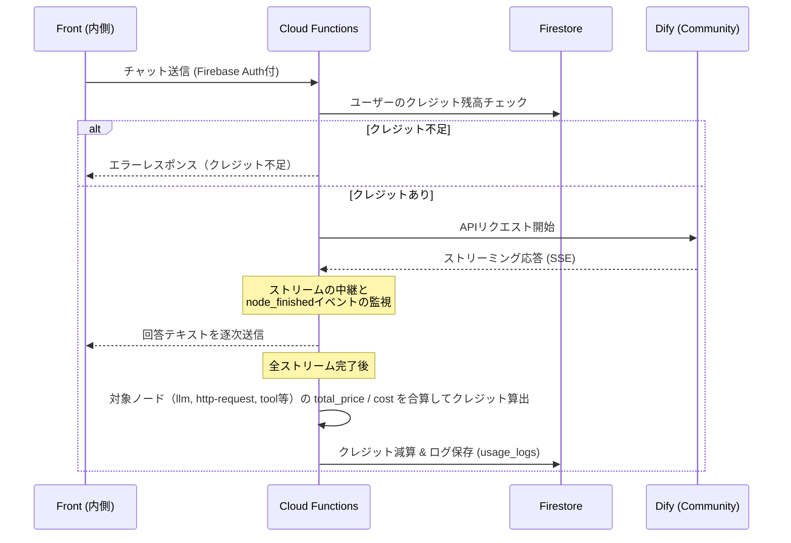

# 社内AIエージェント クレジット管理システム 概要案

**ドキュメントバージョン**: v2.1  
**更新日**: 2026年6月10日

**更新履歴:**
- 2026/06/10 (v2.1): Tier（ティア）制導入に伴い、データモデル等にTier関連の記述を正式反映
- 2026/06/05 (v2): 新規作成・初回提案

---

## 1. プロジェクトの目的と背景

Dify Community 版を利用した社内 AI エージェントにおいて、各 AI モデル（Gemini, GPT など）および外部ツール（Perplexity, Web 検索など）の利用コストを精緻に可視化し、予算超過を防ぐための「クレジット（以下、略称として **CR** を使用する場合があります）管理機能」を構築する。

**採用アプローチ:** 外部の LLMOps ツール（Langfuse 等）は導入せず、**Dify 本体や各ツールが出力する JSON 内の「価格情報（`total_price` / `total_cost`）」を直接中継サーバーで合算する手法**を採用する。これにより、インフラ管理コストを抑えつつ、利用モデルの差異（上位/下位モデル、入力/出力トークン単価の違い）を自動的かつ正確にクレジットに反映させる。

---

## 2. システムアーキテクチャ

### 2.1 構成要素

- **Frontend (React - 内側):** チャット UI。残りクレジットの表示と、不足時のエラーハンドリングを担う。
- **Frontend (React - 外側):** ログイン基盤と管理者向けポータル。「クレジット付与・分析ダッシュボード」を提供する。
- **Backend (Firebase Cloud Functions):** Dify へのリクエスト中継（プロキシ）、ストリーミングイベントのパース、クレジットの計算と Firestore の更新を担う。
- **Database (Firestore):** ユーザーごとのクレジット残高、および利用履歴（ログ）を保存する。
- **LLM Engine (Dify Community Edition):** プロンプト処理、ルーティング、ツール実行を担当。

### 2.2 処理シーケンス



### 2.3 枯渇時のエッジケース対応（実装仕様）

- **ストリーム受信中の枯渇:** メッセージ生成・受信中にクレジットが 0 以下になった場合でも、ストリームは強制切断せず最後まで完了させる。
- **枯渇後の新規送信ブロック:** クレジットが 0 以下の状態では、チャット入力欄自体を非活性（ロック）とし、「クレジット上限に達しました」という専用の UI を常時表示して送信を防ぐ。

---

## 3. クレジットの算出ロジック

### 3.1 価格情報からの直接換算

Dify の対象ノード終了時や、ツール実行時に出力される USD ベースの価格情報に、社内固定レートを掛けてクレジットを算出する。  
**※消費過多を防ぐため、デフォルトでは対象ノードを `llm`, `http-request`, `tool` に限定するが、対象ノードの種類や換算レートは `system_settings` コレクションで管理し、柔軟に変更可能とする。**

- **換算レート（デフォルト）:** `1 USD = 10,000 クレジット (CR)`
- **計算式:**
  - 対象の LLM ノード: `usage.total_price × 10,000`
  - Perplexity 等の対象ツール: `usage.cost.total_cost × 10,000`

### 3.2 価格が出力されないノードのフォールバック（固定クレジット）

RAG（Gemini ファイル検索）など、出力 JSON に価格情報が含まれない、または `0.00` となるツールについては、「実行 1 回あたりの固定クレジット」を加算する。  
この固定価格表もハードコードせず、`system_settings` から取得する。

- **例:**
  - 社内ドキュメント検索（RAG）ノード実行: **+ 50 クレジット**
  - 社内 DB 参照ノード実行: **+ 10 クレジット**

---

## 4. データモデル (Firestore)

### 4.1 `users` コレクション

既存の認証基盤仕様（Firebase Auth カスタムクレーム同期）に則り、既存の `users` ドキュメントに対して今回新規でクレジット管理用のフィールドを追加・拡張する。  
`tier`（クレジット上限クラス）は `role`（権限クラス）とは独立したフィールドとして管理する。

```json
{
  "user_id": "user_123",
  "displayName": "山田 太郎",
  "email": "taro@company.com",
  "department": "営業部",
  "role": "general",
  "tier": 2,
  "credit_balance": 10000,
  "credit_limit": 10000,
  "last_reset_time": 1700000000000
}
```

| フィールド | 型 | 説明 |
|-----------|-----|------|
| `role` | string | 権限クラス（`general` / `admin` 等）。Firebase Auth カスタムクレームと同期 |
| `tier` | number | クレジット上限クラス（`1` / `2` / `3`）。`role` とは独立して管理される |
| `credit_balance` | number | 【今回追加】現在の残りクレジット（CR） |
| `credit_limit` | number | 【今回追加】毎週の付与上限（Tier に対応する値が自動設定される） |
| `last_reset_time` | number | 【今回追加】最後に週次リセットが実行された日時（エポックミリ秒） |

### 4.2 `system_settings` コレクション

システム全体の設定値（グローバルコンフィグ）を保持する。  
Tier 別の付与上限や換算レート、固定価格表などをここで管理し、管理画面から非エンジニアでも柔軟にチューニングできるようにする。

```json
{
  "config_id": "credit_config",

  "default_tier1_limit": 5000,
  "default_tier2_limit": 10000,
  "default_tier3_limit": 20000,

  "usd_to_credit_rate": 10000,
  "fallback_costs": {
    "rag_search": 50,
    "db_lookup": 10
  },
  "billable_node_types": ["llm", "http-request", "tool"]
}
```

| フィールド | 説明 |
|-----------|------|
| `default_tier1_limit` | Tier 1 ユーザーの週次付与上限（5,000 CR） |
| `default_tier2_limit` | Tier 2 ユーザーの週次付与上限（10,000 CR）。新規ユーザーのデフォルト |
| `default_tier3_limit` | Tier 3 ユーザーの週次付与上限（20,000 CR） |
| `usd_to_credit_rate` | 1 USD あたりの CR 換算レート |
| `fallback_costs` | 価格情報が出力されないノードの固定クレジット単価 |
| `billable_node_types` | 課金対象とするノードタイプの一覧 |

### 4.3 `usage_logs` コレクション

Cloud Functions が集計した利用履歴。監査やダッシュボード表示に利用する。

```json
{
  "log_id": "log_987",
  "user_id": "user_123",
  "timestamp": "2026-06-03T10:00:00Z",
  "workflow_id": "HybridQA_Main",
  "total_credits_consumed": 217,
  "details": [
    { "node": "Intent Analyzer",   "price_usd": 0.0015, "credits": 15  },
    { "node": "Perplexity Search", "price_usd": 0.0072, "credits": 72  },
    { "node": "Final Answer",      "price_usd": 0.0130, "credits": 130 }
  ]
}
```

---

## 5. 担当者別 役割定義と実装案

開発効率を高めるため、システムの内側（AI との対話部分）と外側（管理・インフラ部分）で担当を分割する。

### 5.1 【担当：藤井】フロントエンド（チャット内側） & Dify

主にユーザーが直に触れる AI 体験（UI/UX）と、Dify ワークフローの出力安定化を担当する。

- **Dify 側の実装・検証事項**
  - 各 LLM ノードおよびツールノードが、期待通りに `usage.total_price` や `usage.cost.total_cost` を出力しているかの検証。
  - コスト情報が出力されないノード（RAG 等）のリストアップ。
- **フロントエンド（チャット内側）の実装案**
  - **クレジット残高の表示:** サイドバー左下（フッター部分）に、現在の残りクレジットと Tier を表示する UI を追加（折りたたみ時も数値が確認できるレイアウトとする）。
  - **消費クレジットの可視化:** 各メッセージブロックをホバーした際、コピーボタン等のアクションアイコン群と並んで「そのターンで消費した合計クレジット（例: -215 CR）」をバッジ表示する。
  - **送信ブロック機能と警告表示:** 残りクレジットが 0 以下の状態でユーザーが送信を試みた際、`useChat.js` 側で処理をブロックし、チャット履歴内にインラインの警告カード（`InlineErrorCard.tsx`）を表示して管理者に申請を促す。

### 5.2 【担当：村上】フロントエンド（管理画面・外側） & バックエンド (Firebase)

主にログイン認証から連動するデータフローの構築と、管理者向けの機能提供、コスト計算のコアロジックを担当する。

- **バックエンド (Firebase Cloud Functions) の実装案**
  - **プロキシエンドポイント構築:** フロントからのリクエストを受け、Firebase Auth トークンを検証後、Firestore（`users`）から該当 `user_id` の `credit_balance` を取得・チェックする。
  - **ストリーミングのパース（重要）:** Dify から返ってくる Server-Sent Events（SSE）を中継しつつ、`node_finished` イベントを監視。バッファ変数に価格情報を合算し続ける処理を実装する。
  - **フォールバック処理:** RAG ツールなどが呼ばれた際（価格が取得できなかった際）の、固定クレジット加算ロジックの組み込み。
  - **DB 更新バッチ:** ストリーム完了後（`workflow_finished` 時）、計算したクレジットを `users.credit_balance` から減算し、`usage_logs` に証跡を保存する。
  - **次回リセット日の計算:** 週次リセットのタイミング（次の月曜日）をバックエンド側で計算し、残高取得 API のレスポンスに含めてフロントエンドへ供給する。
- **フロントエンド（外側・管理画面）の実装案**
  - **認証との統合:** `AuthContext.tsx` からログイン中のユーザー ID（`userId`）を取得し、`CreditContext.tsx` がバックエンド API を叩いてクレジット残高・Tier・次回リセット日を取得し、アプリ全体に状態を供給する。
  - **ユーザー管理機能（`UserManagementScreen.jsx`）:** 特定ユーザーに対する手動クレジット追加（インセンティブ）、没収、Tier 変更（`users.tier` および `credit_limit` の更新）のUI を実装。加えて、`system_settings` を更新し、各 Tier のデフォルト上限枠を一括変更できる「全体設定パネル」を実装する。
  - **アナリティクス機能（`UsageAnalysisScreen.jsx`）:** `usage_logs` コレクションを集計し、「部署ごとの消費ヒートマップ」や「Tier 別消費分布」「消費クレジット上位者ランキング」をグラフ等で可視化する。

---

## 6. クレジットの復活・継続利用 (Credit Regeneration)

ユーザー離れ（業務効率化の機会損失）を防ぐため、枯渇したクレジットの復活および救済措置として以下の運用とシステム仕様を定義する。

### 6.1 定期自動リセット（基本運用）

- 毎週月曜日（または社内規定の週初め）に、全ユーザーの `credit_balance` を各自の `credit_limit`（= Tier に対応する週次上限）に自動でリセットする。
- ユーザーに安心感を与えるため、フロントエンドで「次回リセット日」を明示する（日付文字列はバックエンド API から供給され、UI はそれを表示するのみとする）。

**【週次リセットの採用根拠】**
- **AI 利用の習慣化:** 月次リセットの場合、月初に使い切ると数週間 AI が使えず習慣化が阻害されるが、週次であれば数日の待機で復活するためモチベーション低下を防げる。
- **コストの平準化（スパイク防止）:** 一定期間に大量のリクエストを集中させる無駄遣いを抑制し、コストを 1 週間単位で均等にコントロールできる。
- **業務サイクルとの親和性:** 多くの業務は 1 週間単位で計画されるため、「今週分の AI 予算」という感覚がユーザーにとって管理しやすい。

### 6.2 Tier 別の週次上限設定

将来的に運用が軌道に乗った段階で、Tier に応じた上限への切り替えを想定する。  
デフォルト値は `system_settings` で管理され、管理画面から一括変更が可能。

| Tier | 週次上限 | 対象ユーザーイメージ | 利用目安 |
|------|--------|----------------|--------|
| **Tier 1** | 5,000 CR/週 | 軽度利用の一般社員 | R0 を 1 日 2〜3 回程度 |
| **Tier 2**（デフォルト） | **10,000 CR/週** | 日常的な業務利用者 | R0/R3 を 1 日数回、週 200〜300 回相当の軽量対話 |
| **Tier 3** | 20,000 CR/週 | 開発者・ヘビー利用者 | 長文ファイルの読み込みや Artifact 生成を多用する層 |

> ※ これらの数値は `system_settings` でチューニング可能な初期仮設定値であり、今後の利用動向・予算状況・モデル単価の変動に応じて管理画面から柔軟に変更することを想定している。

### 6.3 管理者への手動申請（例外運用）

- 業務上の理由により、次回のリセット日（週末）を待たずにクレジットが枯渇した場合、ユーザーは指定のフォーム等を通じて管理者に上限引き上げを申請できる。
- 管理者は専用ポータル（外側管理画面）から、該当ユーザーに対して即座にボーナスクレジットを付与する。

### 6.4 エコモードへの移行（オプション・将来構想）

クレジットが完全に 0 になった際、「完全な送信ブロック」ではなく、高コストな Web 検索をオフにし、安価なモデルに強制フォールバックする「エコモード」へ自動移行する仕様も検討する。

---

## 7. 開発フローとマイルストーン

本機能は、フロントエンド側の UI/UX を先行して定義・実装した上で、バックエンド担当へ連携するフローを採用する。

1. **Phase 1: UI/UX 先行実装（担当：藤井）**
   - API 通信を行わないモックアップ環境（FE モード）にて、チャット画面内のクレジット残高・Tier 表示、消費クレジットのバッジ表示、残高不足時のエラー画面等の画面 UI を実装する。
   - 画面のレイアウトやコンポーネント構成が確定した段階で、バックエンド連携のための「引き継ぎ書（API の想定インターフェースや必要なステートの定義）」を作成する。

2. **Phase 2: バックエンドへの引き継ぎと結合（担当：藤井 → 村上）**
   - 藤井から村上へ、作成した引き継ぎ書をもとに実装内容の共有を行う。
   - 村上にて、Firebase Cloud Functions のプロキシ処理、ストリーミングパースによるクレジット計算、Firestore 連携など、バックエンドのコアロジックを実装する。

3. **Phase 3: 管理画面の実装と最終テスト（担当：村上）**
   - ログイン基盤と連動した管理者向けポータル（Tier 変更・クレジット操作パネル、利用状況の分析グラフ等）を実装する。
   - 最後に Dify の API 出力とフロントエンド・バックエンドを結合し、システム全体での E2E（エンドツーエンド）テストを実施して完了とする。
