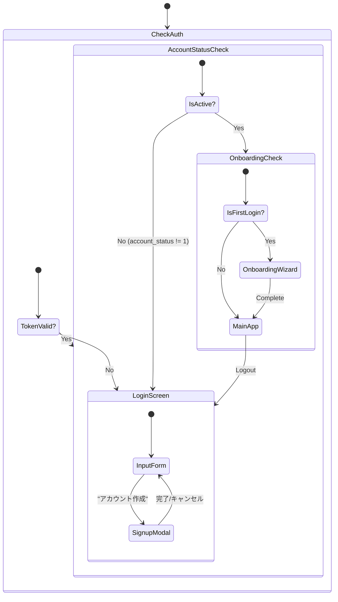
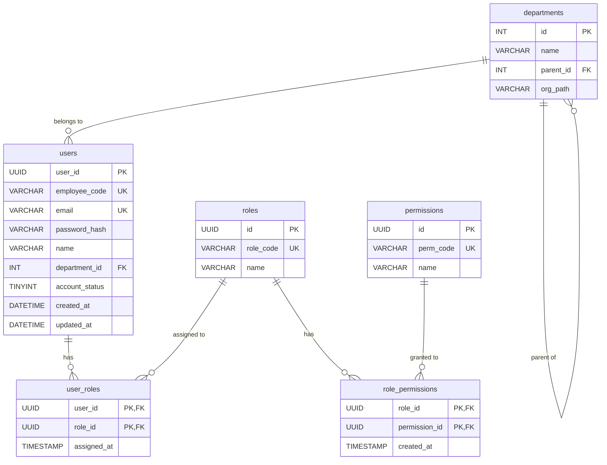

# 社内 AI チャットボット認証機能 基本設計書 (Phase 1.5)

- **プロジェクト名**: 社内 AI チャットボット開発プロジェクト (Desktop Intelligence Era)
- **ドキュメント ID**: DES-AUTH-001
- **バージョン**: 2.0
- **作成日**: 2026/01/07
- **更新日**: 2026/01/28 (正式認証テーブル仕様反映・RBAC対応)
- **関連ドキュメント**: REQ-AUTH-001 (要件定義書), DESIGN_RULE.md, 企業内AIチャットボット基盤における統合ユーザー管理データベースの設計仕様.md

## 1. 開発フェーズ定義

本機能開発は、インフラ環境の整備状況に合わせて 2 段階のフェーズで実施する。本設計書は主に **Phase A** の実装詳細を定義しつつ、Phase B への移行性（Portability）を担保する設計とする。

**重要**: Phase A においても、正式仕様のテーブル構造・RBACアーキテクチャをエミュレートし、Phase B への移行コストを最小化する。

| フェーズ名称                                       | 目的・スコープ                                                                                                       | データ永続化                                                                | 認証方式                                     |
| :------------------------------------------------- | :------------------------------------------------------------------------------------------------------------------- | :-------------------------------------------------------------------------- | :------------------------------------------- |
| **Phase A**<br>Mock Emulation<br>(今回スコープ)    | **UI/UX の確立と、認証ロジックのフロントエンド実装**。<br>正式仕様のRBACテーブル構造をJavaScriptでエミュレートする。 | **Static JS File**<br>(Master Data)<br>+<br>**LocalStorage**<br>(New Users) | **Mock Service**<br>(Client-side Simulation) |
| **Phase B**<br>Backend Integration<br>(将来ゴール) | **本番 DB との接続**。<br>Cloud SQL for PostgreSQLを使用し、セキュリティ強度を高める。                                 | **Cloud SQL for PostgreSQL**                                   | **Real API**<br>(JWT / OAuth)                |

---

## 2. システム構成図

### 2.1. Phase A: Mock Emulation Architecture (Current)

クライアントサイドのみで認証フローを完結させる。AuthService は、正式仕様準拠のモックテーブル（users, roles, permissions, user_roles, role_permissions, departments）と LocalStorage をマージして認証を行う。

```mermaid
graph TD
    User((User))

    subgraph "Client Application (Browser)"
        direction TB

        subgraph "Presentation Layer"
            LoginUI[Login Screen]
            Header[Header UI]
            AppLayout[App Layout]
        end

        subgraph "Application Layer"
            AuthContext[Auth Context Provider]
            useAuth[useAuth Hook]
            PermCheck[Permission Check]
        end

        subgraph "Infrastructure Layer (Mock)"
            AuthService[AuthService (Mock Impl)]
            subgraph "Mock Tables (src/mocks/mockUsers.js)"
                MockUsers[MOCK_USERS]
                MockRoles[MOCK_ROLES]
                MockPerms[MOCK_PERMISSIONS]
                MockUserRoles[MOCK_USER_ROLES]
                MockRolePerms[MOCK_ROLE_PERMISSIONS]
                MockDepts[MOCK_DEPARTMENTS]
            end
        end

        LocalStorage[(LocalStorage<br/>User Preferences)]
    end

    subgraph "External Systems"
        DifyAPI[Dify API Cloud]
    end

    %% Flow
    User --> LoginUI
    LoginUI --> useAuth
    useAuth --> AuthContext
    AuthContext --> AuthService
    AuthService -.->|RBAC Resolution| MockUserRoles
    MockUserRoles -.-> MockRoles
    MockRoles -.-> MockRolePerms
    MockRolePerms -.-> MockPerms
    AuthService <-->|Read/Write| LocalStorage

    AppLayout --> DifyAdapter
    DifyAdapter --> DifyAPI

    %% Identity Injection
    AuthContext -.->|Inject userId| DifyAdapter
    PermCheck -.->|Check permissions| AuthContext

```

### 2.2. Phase B: Backend Integration Architecture (Future)

AuthService の内部実装のみを差し替えることで、UI 層に影響を与えずにバックエンド接続へ移行する。

```mermaid
graph TD
    User((User))

    subgraph "Client Application (Browser)"
        direction TB
        LoginUI[Login Screen]
        useAuth[useAuth Hook]

        subgraph "Infrastructure Layer (Real)"
            AuthService[AuthService (API Client)]
        end
    end

    subgraph "Backend Infrastructure"
        AuthAPI[Auth API / Firebase Auth]
        subgraph "Cloud SQL for PostgreSQL"
            UsersTable[(users)]
            RolesTable[(roles)]
            PermissionsTable[(permissions)]
            UserRolesTable[(user_roles)]
            RolePermissionsTable[(role_permissions)]
            DepartmentsTable[(departments)]
        end
    end

    %% Flow
    User --> LoginUI
    LoginUI --> useAuth
    useAuth --> AuthService
    AuthService -->|HTTPS / JSON| AuthAPI
    AuthAPI --> UsersTable
    AuthAPI --> UserRolesTable
    AuthAPI --> RolesTable

```

---

## 3. 機能一覧・機能仕様

フェーズによる挙動の違いを定義する。

### 3.1. 認証機能 (Auth Core)

| 機能 ID        | 機能名   | Phase A (Mock) 仕様                                                                               | Phase B (Real) 仕様 |
| -------------- | -------- | ------------------------------------------------------------------------------------------------- | ------------------- |
| **F-AUTH-001** | ログイン | ・モックテーブルからユーザーを検索し、`account_status` を検証。<br>・RBACを解決し、実効権限を取得。<br>・`setTimeout` で通信遅延（0.5-1.0s）を演出。 | ・API エンドポイントへ POST リクエスト<br>・正規の JWT トークン検証<br>・サーバー側でRBAC解決 |
| **F-AUTH-002** | サインアップ | ・LocalStorage へ新規ユーザーを追加。<br>・デフォルトで `role_general` を割り当て。<br>・ブラウザキャッシュクリアで消える一時ユーザー。 | ・API 経由で DB へ INSERT<br>・排他制御、トランザクション管理 |
| **F-AUTH-003** | ログアウト | ・LocalStorage からセッションキー削除 | ・LocalStorage 削除 + サーバー側セッション無効化 (Optional) |
| **F-AUTH-004** | セッション維持 | ・LocalStorage に保存したダミートークンの有無で判定 | ・JWT の有効期限(exp)検証<br>・リフレッシュトークン処理 |
| **F-AUTH-005** | 権限チェック | ・`hasPermission(user, permCode)` で実効権限を検証 | ・サーバー側で権限検証<br>・フロントエンドでもキャッシュ権限でUI制御 |

### 3.2. ユーザープロファイル機能

| 機能 ID        | 機能名   | 共通仕様 (Both Phases)                                                                                                                                                                         |
| -------------- | -------- | ---------------------------------------------------------------------------------------------------------------------------------------------------------------------------------------------- |
| **F-PROF-001** | ID 連携  | 認証ソースに関わらず、取得した `userId` を Dify API の `user` パラメータに必ずセットする。                                                                                                     |
| **F-PROF-002** | 設定同期 | `theme`, `aiStyle` などの設定値をユーザーデータの一部として Load/Save するインターフェースを統一する。Phase A では定義済みユーザーの設定変更は LocalStorage に上書き保存する（Overlay 方式）。 |
| **F-PROF-003** | 部署情報 | `departmentId` から部署名・組織階層を解決し、UIに表示可能とする。 |

---

## 4. 画面設計

DESIGN_RULE.md に準拠し、macOS Sequoia の世界観を体現する UI を構築する。Phase A/B で UI の変更は発生させない。

### 4.1. 画面遷移図



### 4.2. UI コンポーネント定義

**SC-01: Login Screen (Entrace to Intelligence)**

- **背景**: `FluidOrbBackground` を使用。Cyan/Magenta/Yellow/Blue のオーブがゆっくりと浮遊し、知性を表現する。
- **コンテナ**: 画面中央に配置。`mat-hud` (Blur 50px + Saturate 200%) マテリアルを適用。角丸は 24px。
- **インタラクション**:
  - 入力フォームのフォーカス時に `ring-focus` エフェクト。
  - ボタン押下時に Framer Motion の Spring アニメーション。

- **Phase A 特有**: ログインボタン押下後、意図的に 0.8 秒程度のローディングを表示し、「処理している感」を演出する。
- **アカウント状態エラー**: `account_status` が有効でない場合、ユーザーフレンドリーなエラーメッセージを表示。

---

## 5. API 設計 (Interface Definition)

Phase A/B 共通の `AuthService` インターフェースを定義する。
Phase A ではこれをモッククラスとして実装する。

### 5.1. 型定義（正式仕様準拠）

```typescript
// ============================================
// アカウント状態
// ============================================
type AccountStatus = 0 | 1 | 2;  // 0: 無効, 1: 有効, 2: 退職

// ============================================
// 権限コード（正式仕様より）
// ============================================
type PermissionCode = 
  | 'chat:send'        // チャット送信
  | 'chat:view_own'    // 自分の履歴閲覧
  | 'chat:view_all'    // 全履歴閲覧
  | 'user:read'        // ユーザー情報閲覧
  | 'user:write'       // ユーザー情報編集
  | 'admin:access'     // 管理画面アクセス
  | 'knowledge:manage'; // ナレッジストア管理

// ============================================
// 役割コード
// ============================================
type RoleCode = 'admin' | 'general' | 'viewer';

// ============================================
// ユーザーに割り当てられた役割
// ============================================
interface UserRole {
  roleId: string;
  roleCode: RoleCode;
  roleName: string;        // 日本語名（例: "管理者"）
  assignedAt: string;      // ISO 8601形式
}

// ============================================
// ユーザー設定
// ============================================
interface UserPreferences {
  theme: 'light' | 'dark' | 'system';
  aiStyle: 'partner' | 'efficient';
  ragMode: 'hybrid' | 'search' | 'rag';
}

// ============================================
// ユーザープロファイル（正式仕様準拠）
// ============================================
interface UserProfile {
  userId: string;                    // Dify連携用ID (UUID)
  employeeCode?: string;             // 社員番号
  email: string;
  name: string;                      // 社員氏名（フルネーム）
  displayName?: string;              // 表示名（後方互換用）
  avatarUrl?: string;
  departmentId?: number;             // 所属部署ID
  departmentName?: string;           // 所属部署名（解決済み）
  accountStatus: AccountStatus;
  roles: UserRole[];                 // RBAC: 割り当てられたロール
  permissions: PermissionCode[];     // 実効権限リスト（解決済み）
  preferences: UserPreferences;
  createdAt?: string;
  updatedAt?: string;
}
```

### 5.2. AuthService インターフェース

```typescript
interface AuthServiceInterface {
  // ============================================
  // 認証メソッド
  // ============================================
  
  /**
   * ログイン
   * - email/password でユーザーを検索
   * - account_status を検証（有効なユーザーのみ許可）
   * - RBAC を解決し、実効権限を含む UserProfile を返却
   */
  login(
    email: string,
    password: string
  ): Promise<{ token: string; user: UserProfile }>;

  /**
   * サインアップ
   * - 新規ユーザーを作成
   * - デフォルトで 'general' ロールを割り当て
   */
  signup(
    email: string,
    password: string,
    name: string
  ): Promise<{ token: string; user: UserProfile }>;

  /**
   * セッション復元
   * - トークンからユーザー情報を復元
   * - account_status の再検証を実施
   */
  restoreSession(token: string): Promise<UserProfile>;

  /**
   * ログアウト
   */
  logout(): Promise<void>;

  // ============================================
  // 設定管理メソッド
  // ============================================
  
  /**
   * 設定更新
   */
  updatePreferences(
    userId: string,
    prefs: Partial<UserPreferences>
  ): Promise<UserPreferences>;

  // ============================================
  // RBAC メソッド
  // ============================================
  
  /**
   * 権限チェック
   * - ユーザーが指定された権限を持つかどうかを判定
   */
  hasPermission(user: UserProfile, permCode: PermissionCode): boolean;

  /**
   * ユーザーのロール取得
   */
  getUserRoles(userId: string): Promise<UserRole[]>;

  /**
   * ロールから権限を解決
   */
  resolvePermissions(roles: UserRole[]): Promise<PermissionCode[]>;
}
```

---

## 6. データベース設計

### 6.1. Phase A: Mock Schema (Source Code + LocalStorage)

Phase A では、正式仕様「企業内AIチャットボット基盤における統合ユーザー管理データベースの設計仕様」に準拠したテーブル構造を JavaScript オブジェクトでエミュレートする。

#### テーブル構成概要

| テーブル名 | 説明 | Phase A 実装 |
|:---|:---|:---|
| `users` | 認証基盤・ユーザー情報 | `MOCK_USERS` 配列 |
| `roles` | 役割定義 | `MOCK_ROLES` 配列 |
| `permissions` | 権限定義 | `MOCK_PERMISSIONS` 配列 |
| `user_roles` | ユーザー-役割マッピング | `MOCK_USER_ROLES` 配列 |
| `role_permissions` | 役割-権限マッピング | `MOCK_ROLE_PERMISSIONS` 配列 |
| `departments` | 組織階層 | `MOCK_DEPARTMENTS` 配列 |

#### RBAC リレーションシップ図



#### Mock Data File Definition

```javascript
// src/mocks/mockUsers.js

// ============================================
// 1. 権限定義テーブル (permissions)
// ============================================
export const MOCK_PERMISSIONS = [
  { id: 'perm_001', perm_code: 'chat:send', name: 'チャット送信' },
  { id: 'perm_002', perm_code: 'chat:view_own', name: '自分の履歴閲覧' },
  { id: 'perm_003', perm_code: 'chat:view_all', name: '全履歴閲覧' },
  { id: 'perm_004', perm_code: 'user:read', name: 'ユーザー情報閲覧' },
  { id: 'perm_005', perm_code: 'user:write', name: 'ユーザー情報編集' },
  { id: 'perm_006', perm_code: 'admin:access', name: '管理画面アクセス' },
  { id: 'perm_007', perm_code: 'knowledge:manage', name: 'ナレッジストア管理' },
];

// ============================================
// 2. 役割定義テーブル (roles)
// ============================================
export const MOCK_ROLES = [
  { id: 'role_admin', role_code: 'admin', name: '管理者' },
  { id: 'role_general', role_code: 'general', name: '一般ユーザー' },
  { id: 'role_viewer', role_code: 'viewer', name: '閲覧専用' },
];

// ============================================
// 3. 役割-権限マッピング (role_permissions)
// ============================================
export const MOCK_ROLE_PERMISSIONS = [
  // 管理者: 全権限
  { role_id: 'role_admin', permission_id: 'perm_001' },
  { role_id: 'role_admin', permission_id: 'perm_002' },
  { role_id: 'role_admin', permission_id: 'perm_003' },
  { role_id: 'role_admin', permission_id: 'perm_004' },
  { role_id: 'role_admin', permission_id: 'perm_005' },
  { role_id: 'role_admin', permission_id: 'perm_006' },
  { role_id: 'role_admin', permission_id: 'perm_007' },
  // 一般ユーザー: チャット + 自分の情報
  { role_id: 'role_general', permission_id: 'perm_001' },
  { role_id: 'role_general', permission_id: 'perm_002' },
  { role_id: 'role_general', permission_id: 'perm_004' },
  // 閲覧専用
  { role_id: 'role_viewer', permission_id: 'perm_002' },
];

// ============================================
// 4. 組織階層テーブル (departments)
// ============================================
export const MOCK_DEPARTMENTS = [
  { id: 1, name: '本社', parent_id: null, org_path: '1' },
  { id: 2, name: '営業部', parent_id: 1, org_path: '1.2' },
  { id: 3, name: '開発部', parent_id: 1, org_path: '1.3' },
  { id: 4, name: '第一営業課', parent_id: 2, org_path: '1.2.4' },
  { id: 5, name: '第二営業課', parent_id: 2, org_path: '1.2.5' },
];

// ============================================
// 5. ユーザーテーブル (users) - 正式仕様準拠
// ============================================
export const MOCK_USERS = [
  {
    user_id: 'usr_admin_001',
    employee_code: 'EMP001',
    email: 'admin@example.com',
    password_hash: 'password',  // Phase A: 平文（本番はハッシュ化）
    name: '管理者 太郎',
    department_id: 1,
    account_status: 1,  // 1: 有効
    created_at: '2026-01-01T00:00:00Z',
    updated_at: '2026-01-01T00:00:00Z',
    // Phase A 専用: 設定値（将来は別テーブル化も検討）
    preferences: {
      theme: 'dark',
      aiStyle: 'efficient',
      ragMode: 'rag',
    },
  },
  {
    user_id: 'usr_partner_001',
    employee_code: 'EMP002',
    email: 'user@example.com',
    password_hash: 'password',
    name: '一般 花子',
    department_id: 4,
    account_status: 1,
    created_at: '2026-01-01T00:00:00Z',
    updated_at: '2026-01-01T00:00:00Z',
    preferences: {
      theme: 'system',
      aiStyle: 'partner',
      ragMode: 'hybrid',
    },
  },
  {
    user_id: 'usr_retired_001',
    employee_code: 'EMP099',
    email: 'retired@example.com',
    password_hash: 'password',
    name: '退職 三郎',
    department_id: 3,
    account_status: 2,  // 2: 退職済み（ログイン不可テスト用）
    created_at: '2025-01-01T00:00:00Z',
    updated_at: '2026-01-15T00:00:00Z',
    preferences: {},
  },
];

// ============================================
// 6. ユーザー-役割マッピング (user_roles)
// ============================================
export const MOCK_USER_ROLES = [
  { user_id: 'usr_admin_001', role_id: 'role_admin', assigned_at: '2026-01-01T00:00:00Z' },
  { user_id: 'usr_partner_001', role_id: 'role_general', assigned_at: '2026-01-01T00:00:00Z' },
  { user_id: 'usr_retired_001', role_id: 'role_general', assigned_at: '2025-01-01T00:00:00Z' },
];
```

#### Runtime Behavior (AuthService Mock Implementation)

```javascript
// src/services/AuthService.js

import {
  MOCK_USERS,
  MOCK_ROLES,
  MOCK_PERMISSIONS,
  MOCK_USER_ROLES,
  MOCK_ROLE_PERMISSIONS,
  MOCK_DEPARTMENTS
} from '../mocks/mockUsers.js';

class MockAuthService {
  /**
   * ログイン処理
   * 1. email/passwordでユーザーを検索
   * 2. account_statusを検証（有効なユーザーのみ許可）
   * 3. user_roles → role_permissions を辿って実効権限を解決
   */
  async login(email, password) {
    // 通信遅延のエミュレーション
    await this.simulateDelay(500, 1000);
    
    // 1. ユーザー検索（マスター + ローカル）
    const user = this.findUserByCredentials(email, password);
    if (!user) {
      throw new Error('メールアドレスまたはパスワードが正しくありません');
    }
    
    // 2. アカウント状態チェック
    if (user.account_status === 0) {
      throw new Error('このアカウントは無効化されています');
    }
    if (user.account_status === 2) {
      throw new Error('このアカウントは退職済みです');
    }
    
    // 3. RBAC解決: ロールと権限を取得
    const roles = this.getUserRoles(user.user_id);
    const permissions = this.resolvePermissions(roles);
    const department = this.getDepartment(user.department_id);
    
    // 4. UserProfile構築
    const token = `mock_token_${user.user_id}_${Date.now()}`;
    const userProfile = {
      userId: user.user_id,
      employeeCode: user.employee_code,
      email: user.email,
      name: user.name,
      displayName: user.name,  // 後方互換
      departmentId: user.department_id,
      departmentName: department?.name,
      accountStatus: user.account_status,
      roles: roles,
      permissions: permissions.map(p => p.perm_code),
      preferences: user.preferences || {},
      createdAt: user.created_at,
      updatedAt: user.updated_at,
    };
    
    // セッション保存
    localStorage.setItem('auth_token', token);
    localStorage.setItem('auth_user', JSON.stringify(userProfile));
    
    return { token, user: userProfile };
  }

  /**
   * ユーザーに割り当てられたロールを取得
   */
  getUserRoles(userId) {
    return MOCK_USER_ROLES
      .filter(ur => ur.user_id === userId)
      .map(ur => {
        const role = MOCK_ROLES.find(r => r.id === ur.role_id);
        return {
          roleId: role.id,
          roleCode: role.role_code,
          roleName: role.name,
          assignedAt: ur.assigned_at,
        };
      });
  }

  /**
   * ロールから実効権限を解決
   */
  resolvePermissions(roles) {
    const permissionIds = new Set();
    roles.forEach(role => {
      MOCK_ROLE_PERMISSIONS
        .filter(rp => rp.role_id === role.roleId)
        .forEach(rp => permissionIds.add(rp.permission_id));
    });
    return MOCK_PERMISSIONS.filter(p => permissionIds.has(p.id));
  }

  /**
   * 部署情報を取得
   */
  getDepartment(departmentId) {
    return MOCK_DEPARTMENTS.find(d => d.id === departmentId);
  }

  /**
   * 権限チェックユーティリティ
   */
  hasPermission(user, permCode) {
    return user.permissions.includes(permCode);
  }

  /**
   * 通信遅延シミュレーション
   */
  simulateDelay(min, max) {
    const delay = Math.random() * (max - min) + min;
    return new Promise(resolve => setTimeout(resolve, delay));
  }
}

export const authService = new MockAuthService();
```

### 6.2. Phase B: Target Schema (Cloud SQL for PostgreSQL)

正式仕様「企業内AIチャットボット基盤における統合ユーザー管理データベースの設計仕様」に完全準拠したテーブル構成。

#### users テーブル（認証基盤）

| カラム名 | データ型 | 制約 | 説明 | 必須 |
|:---|:---|:---|:---|:---|
| `user_id` | `UUID` | `PRIMARY KEY` | ユーザーを一意に識別する内部ID | ○ |
| `employee_code` | `VARCHAR(10)` | `UNIQUE`, `NOT NULL` | 既存の社員番号との紐付け用キー | |
| `email` | `VARCHAR(255)` | `UNIQUE`, `NOT NULL` | 会社用メールアドレス | ○ |
| `password_hash` | `VARCHAR(255)` | `NOT NULL` | bcrypt/Argon2でハッシュ化 | ○ |
| `department_id` | `INT` | `FK (departments.id)` | 組織階層テーブルへの参照 | |
| `account_status` | `TINYINT` | `DEFAULT 1` | 1: 有効, 0: 無効, 2: 退職 | |
| `name` | `VARCHAR(100)` | `NOT NULL` | 社員氏名（フルネーム） | ○ |
| `created_at` | `TIMESTAMP` | `DEFAULT NOW()` | レコード作成日時 | |
| `updated_at` | `TIMESTAMP` | `DEFAULT NOW()` | レコード最終更新日時 | |

#### roles テーブル（役割定義）

| カラム名 | 型 | 制約 | 説明 |
|:---|:---|:---|:---|
| `id` | `UUID` | `PRIMARY KEY` | ロールID |
| `role_code` | `VARCHAR(50)` | `UNIQUE` | `admin`, `general` 等のコード |
| `name` | `VARCHAR(100)` | `NOT NULL` | ロールの日本語名 |

#### permissions テーブル（権限定義）

| カラム名 | 型 | 制約 | 説明 |
|:---|:---|:---|:---|
| `id` | `UUID` | `PRIMARY KEY` | 権限ID |
| `perm_code` | `VARCHAR(50)` | `UNIQUE` | `chat:view_all`, `user:write` 等 |
| `name` | `VARCHAR(100)` | `NOT NULL` | 権限内容の日本語説明 |

#### user_roles 中間テーブル

| カラム名 | 型 | 制約 | 説明 |
|:---|:---|:---|:---|
| `user_id` | `UUID` | `PK`, `FK (users.user_id)` | ユーザーID（CASCADE DELETE） |
| `role_id` | `UUID` | `PK`, `FK (roles.id)` | 割り当てる役割のID |
| `assigned_at` | `TIMESTAMP` | `DEFAULT NOW()` | 役割を付与した日時 |

#### role_permissions 中間テーブル

| カラム名 | 型 | 制約 | 説明 |
|:---|:---|:---|:---|
| `role_id` | `UUID` | `PK`, `FK (roles.id)` | 対象となる役割のID |
| `permission_id` | `UUID` | `PK`, `FK (permissions.id)` | 役割に含まれる権限ID |
| `created_at` | `TIMESTAMP` | `DEFAULT NOW()` | 権限セットを構成した日時 |

#### departments テーブル（組織階層）

| カラム名 | データ型 | 制約 | 説明 |
|:---|:---|:---|:---|
| `id` | `SERIAL` | `PRIMARY KEY` | 部署を一意に識別するID |
| `name` | `VARCHAR(100)` | `NOT NULL` | 部署名（例：第一営業課） |
| `parent_id` | `INT` | `FK (departments.id)` | 親部署のID（ルート部署はNULL） |
| `org_path` | `LTREE` | | 階層パス（高速な部分木検索用） |

### 6.3. 将来対応テーブル（Phase B 追加要件）

正式仕様に基づき、以下のテーブルを将来の拡張として設計に含める。

#### chat_sessions テーブル（会話セッション履歴）

| カラム名 | 型 | 制約 | 説明 |
|:---|:---|:---|:---|
| `id` | `UUID` | `PRIMARY KEY` | セッションID（Dify等の外部IDと同期） |
| `workspace_id` | `UUID` | `FK` | 利用されたワークスペース |
| `user_id` | `UUID` | `FK (users.user_id)` | 利用ユーザー |
| `started_at` | `TIMESTAMP` | | 開始日時 |
| `ended_at` | `TIMESTAMP` | | 終了または最終アクティブ日時 |

#### usage_metrics テーブル（利用メトリクスログ）

| カラム名 | 型 | 制約 | 説明 |
|:---|:---|:---|:---|
| `id` | `BIGSERIAL` | `PRIMARY KEY` | ログ一意ID |
| `session_id` | `UUID` | `FK` | 紐付くセッション |
| `model_name` | `VARCHAR(50)` | | 使用されたモデル名（例: gemini-pro） |
| `prompt_tokens` | `INT` | | 入力（質問）の消費トークン数 |
| `completion_tokens` | `INT` | | 出力（回答）の消費トークン数 |
| `latency_ms` | `INT` | | AIの推論にかかった時間（ミリ秒） |
| `created_at` | `TIMESTAMP` | | ログ記録日時 |

---

## 7. 開発ロードマップ (Phase Detail)

### 7.1. Phase A: Mock Emulation (詳細)

以下のステップ順に実装を進め、手戻りを最小化する。

#### Step A-1: データ構造とモックサービスの基盤実装

- **目標**: 正式仕様準拠のRBACテーブル構造をモックデータとして実装し、コンソール上で AuthService が期待通りに動作することを確認する。
- **タスク**:
  - `src/mocks/mockUsers.js` の作成（全6テーブルのモックデータ定義）。
  - `src/services/AuthService.js` クラスの作成。
    - `login(email, password)`: マスター/ローカル両方を検索 + RBAC解決ロジックの実装。
    - `signup(...)`: LocalStorage への保存 + デフォルトロール割り当てロジックの実装。
    - `restoreSession()`: トークン検証 + account_status 再検証ロジックの実装。
    - `hasPermission(user, permCode)`: 権限チェックユーティリティの実装。

#### Step A-2: 認証コンテキストとフックの実装

- **目標**: アプリケーション全体でログイン状態と権限情報を共有できる状態にする。
- **タスク**:
  - `src/context/AuthContext.jsx` の作成。
  - `useAuth` フックの実装（login, logout, user, loading, hasPermission を提供）。
  - `src/main.jsx` または `src/App.jsx` をラップし、Context を有効化。
  - 既存の `localStorage.getItem('app_user_id')` ロジックを、`useAuth` 経由の `user.userId` 参照へ置き換えるリファクタリング。

#### Step A-3: UI コンポーネント実装 (Liquid Glass & Animation)

- **目標**: DESIGN_RULE.md に準拠した美しいログイン画面を表示する。
- **タスク**:
  - `src/components/Auth/LoginScreen.jsx` の作成。
    - `FluidOrbBackground` を背景に配置。
    - `mat-hud` クラスを使用したパネル実装。
    - account_status エラー時のユーザーフレンドリーなメッセージ表示。
  - `src/components/Auth/SignupModal.jsx` の作成。
  - Framer Motion による遷移・入力アニメーションの実装。

#### Step A-4: 統合とルーティング制御

- **目標**: ログイン状態と権限に応じて画面が正しく切り替わるようにする。
- **タスク**:
  - `src/App.jsx` のメインレンダリングロジックの修正。
    - `if (!isAuthenticated) return <LoginScreen />` のようなガード処理を追加。
    - account_status による追加チェック。
  - オンボーディング (OnboardingScreen) の表示条件修正。
  - 権限による UI 要素の表示制御（例: 管理者のみ設定画面を表示）。

#### Step A-5: Dify 連携部分の改修

- **目標**: ログインしたユーザー ID で会話が行われるようにする。
- **タスク**:
  - `useChat` フック内の API 呼び出し修正。
    - `inputs.user` パラメータに `auth.user.userId` を渡すように変更。
  - 設定同期機能の実装（ログイン時にサーバー/MockDB の設定をローカルに反映）。

### 7.2. Phase B: Backend Integration (概要)

Phase A の完了後、インフラ選定が完了次第着手する。

- **インフラ選定**:
  - Auth Provider (Firebase Auth / Auth0 / Supabase / 自社基盤) の決定。
  - Database: Cloud SQL for PostgreSQL（正式仕様に準拠）。

- **API 実装 / SDK 導入**:
  - 選定したサービスの SDK を導入。
  - RBAC解決ロジックをサーバーサイドに移行。

- **AuthService 差し替え**:
  - AuthService のメソッド内部をモック実装から、実際の SDK/API 呼び出しに書き換える。
  - **重要**: UI コンポーネントや `useAuth` フックは変更せず、Adapter 層の変更のみで移行を完了させる。

---

## 8. セキュリティ考慮事項

正式仕様「2025-2026年を見据えたセキュリティ・アーキテクチャ」に基づく設計指針。

### 8.1. Phase A での対応

- **パスワード**: モック環境では平文保存だが、本番移行時はbcrypt/Argon2でハッシュ化必須。
- **account_status**: 退職ユーザー・無効化ユーザーのログイン拒否をエミュレート。
- **権限チェック**: フロントエンドでの権限チェックをエミュレートし、Phase B への移行準備。

### 8.2. Phase B での追加対応

- **通信の暗号化**: 全通信はHTTPS (TLS 1.3) で行う。
- **保存データの暗号化**: PIIカラムに対するカラムレベル暗号化（AES-256-GCM）。
- **多要素認証（MFA）**: 管理画面へのアクセスにはMFAを要求。
- **監査ログ**: 変更前後の値（Before/After）を保存し、不正操作の追跡を可能に。
- **最小権限の原則**: 不要な権限の定期的なレビュープロセスを導入。
