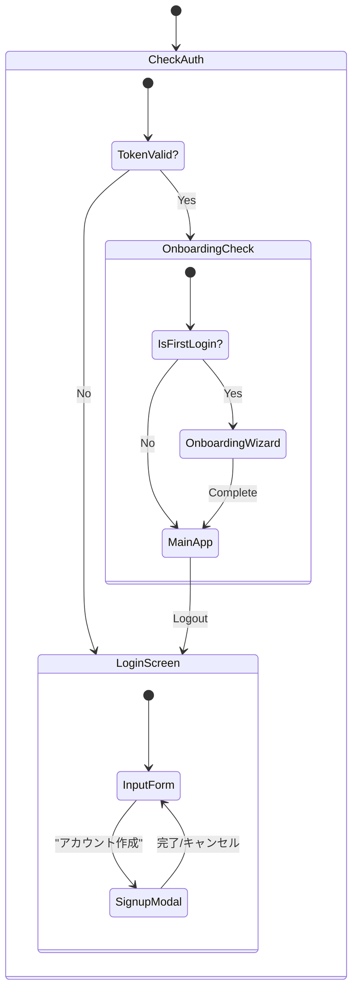

# 社内 AI チャットボット認証機能 基本設計書 (Phase 1.5)

- **プロジェクト名**: 社内 AI チャットボット開発プロジェクト (Desktop Intelligence Era)
- **ドキュメント ID**: DES-AUTH-001
- **バージョン**: 1.4
- **作成日**: 2026/01/07
- **更新日**: 2026/01/07 (ロードマップ詳細化)
- **関連ドキュメント**: REQ-AUTH-001 (要件定義書), DESIGN_RULE.md

## 1. 開発フェーズ定義

本機能開発は、インフラ環境の整備状況に合わせて 2 段階のフェーズで実施する。本設計書は主に **Phase A** の実装詳細を定義しつつ、Phase B への移行性（Portability）を担保する設計とする。

| フェーズ名称                                       | 目的・スコープ                                                                                                       | データ永続化                                                                | 認証方式                                     |
| :------------------------------------------------- | :------------------------------------------------------------------------------------------------------------------- | :-------------------------------------------------------------------------- | :------------------------------------------- |
| **Phase A**<br>Mock Emulation<br>(今回スコープ)    | **UI/UX の確立と、認証ロジックのフロントエンド実装**。<br>ソースコード上で定義した複数アカウントでの動作検証を行う。 | **Static JS File**<br>(Master Data)<br>+<br>**LocalStorage**<br>(New Users) | **Mock Service**<br>(Client-side Simulation) |
| **Phase B**<br>Backend Integration<br>(将来ゴール) | **本番 DB との接続**。<br>セキュリティ強度を高め、デバイス間のデータ同期を実現する。                                 | **Remote DB**<br>(Firestore / PostgreSQL)                                   | **Real API**<br>(JWT / OAuth)                |

---

## 2. システム構成図

### 2.1. Phase A: Mock Emulation Architecture (Current)

クライアントサイドのみで認証フローを完結させる。AuthService は、ソースコードとして定義されたユーザーリスト（マスターデータ）と LocalStorage をマージして認証を行う。

```mermaid
graph TD
    User((User))

    subgraph "Client Application (Browser)"
        direction TB

        subgraph "Presentation Layer"
            LoginUI[Login Screen]
            Header[Header UI]
            AppLayout[App Layout]
        end

        subgraph "Application Layer"
            AuthContext[Auth Context Provider]
            useAuth[useAuth Hook]
        end

        subgraph "Infrastructure Layer (Mock)"
            AuthService[AuthService (Mock Impl)]
            MockData[src/mocks/mockUsers.js<br/>(Master Accounts)]
        end

        LocalStorage[(LocalStorage<br/>User Preferences)]
    end

    subgraph "External Systems"
        DifyAPI[Dify API Cloud]
    end

    %% Flow
    User --> LoginUI
    LoginUI --> useAuth
    useAuth --> AuthContext
    AuthContext --> AuthService
    AuthService -.->|Read Only| MockData
    AuthService <-->|Read/Write| LocalStorage

    AppLayout --> DifyAdapter
    DifyAdapter --> DifyAPI

    %% Identity Injection
    AuthContext -.->|Inject userId| DifyAdapter

```

### 2.2. Phase B: Backend Integration Architecture (Future)

AuthService の内部実装のみを差し替えることで、UI 層に影響を与えずにバックエンド接続へ移行する。

```mermaid
graph TD
    User((User))

    subgraph "Client Application (Browser)"
        direction TB
        LoginUI[Login Screen]
        useAuth[useAuth Hook]

        subgraph "Infrastructure Layer (Real)"
            AuthService[AuthService (API Client)]
        end
    end

    subgraph "Backend Infrastructure"
        AuthAPI[Auth API / Firebase Auth]
        UserDB[(User Database)]
    end

    %% Flow
    User --> LoginUI
    LoginUI --> useAuth
    useAuth --> AuthService
    AuthService -->|HTTPS / JSON| AuthAPI
    AuthAPI --> UserDB

```

---

## 3. 機能一覧・機能仕様

フェーズによる挙動の違いを定義する。

### 3.1. 認証機能 (Auth Core)

| 機能 ID        | 機能名   | Phase A (Mock) 仕様                                                                               | Phase B (Real) 仕様 |
| -------------- | -------- | ------------------------------------------------------------------------------------------------- | ------------------- |
| **F-AUTH-001** | ログイン | ・`src/mocks/mockUsers.js` 内の定義済みユーザー、または LocalStorage 内のユーザーと照合する。<br> |

<br>・`setTimeout` で通信遅延（0.5-1.0s）を演出。 | ・API エンドポイントへ POST リクエスト<br>

<br>・正規の JWT トークン検証 |
| **F-AUTH-002** | サインアップ | ・LocalStorage へ新規 JSON オブジェクトを追加。<br>

<br>・ブラウザキャッシュクリアで消える一時的なユーザーとして扱う。 | ・API 経由で DB へ INSERT<br>

<br>・排他制御、トランザクション管理 |
| **F-AUTH-003** | ログアウト | ・LocalStorage からセッションキー削除 | ・LocalStorage 削除 + サーバー側セッション無効化 (Optional) |
| **F-AUTH-004** | セッション維持 | ・LocalStorage に保存したダミートークンの有無で判定 | ・JWT の有効期限(exp)検証<br>

<br>・リフレッシュトークン処理 |

### 3.2. ユーザープロファイル機能

| 機能 ID        | 機能名   | 共通仕様 (Both Phases)                                                                                                                                                                         |
| -------------- | -------- | ---------------------------------------------------------------------------------------------------------------------------------------------------------------------------------------------- |
| **F-PROF-001** | ID 連携  | 認証ソースに関わらず、取得した `userId` を Dify API の `user` パラメータに必ずセットする。                                                                                                     |
| **F-PROF-002** | 設定同期 | `theme`, `aiStyle` などの設定値をユーザーデータの一部として Load/Save するインターフェースを統一する。Phase A では定義済みユーザーの設定変更は LocalStorage に上書き保存する（Overlay 方式）。 |

---

## 4. 画面設計

DESIGN_RULE.md に準拠し、macOS Sequoia の世界観を体現する UI を構築する。Phase A/B で UI の変更は発生させない。

### 4.1. 画面遷移図



### 4.2. UI コンポーネント定義

**SC-01: Login Screen (Entrace to Intelligence)**

- **背景**: `FluidOrbBackground` を使用。Cyan/Magenta/Yellow/Blue のオーブがゆっくりと浮遊し、知性を表現する。
- **コンテナ**: 画面中央に配置。`mat-hud` (Blur 50px + Saturate 200%) マテリアルを適用。角丸は 24px。
- **インタラクション**:
- 入力フォームのフォーカス時に `ring-focus` エフェクト。
- ボタン押下時に Framer Motion の Spring アニメーション。

- **Phase A 特有**: ログインボタン押下後、意図的に 0.8 秒程度のローディングを表示し、「処理している感」を演出する。

---

## 5. API 設計 (Interface Definition)

Phase A/B 共通の `AuthService` インターフェースを定義する。
Phase A ではこれをモッククラスとして実装する。

```typescript
interface UserProfile {
  userId: string; // Dify連携用ID
  email: string;
  displayName: string;
  avatarUrl?: string;
  role: "user" | "admin";
  preferences: UserPreferences;
}

interface AuthServiceInterface {
  // ログイン
  login(
    email: string,
    password: string
  ): Promise<{ token: string; user: UserProfile }>;

  // サインアップ
  signup(
    email: string,
    password: string,
    displayName: string
  ): Promise<{ token: string; user: UserProfile }>;

  // セッション復元
  restoreSession(token: string): Promise<UserProfile>;

  // ログアウト
  logout(): Promise<void>;

  // 設定更新
  updatePreferences(
    userId: string,
    prefs: Partial<UserPreferences>
  ): Promise<UserPreferences>;
}
```

---

## 6. データベース設計

### 6.1. Phase A: Mock Schema (Source Code + LocalStorage)

Phase A では、ソースコードで管理する「マスターユーザー」と、ブラウザで一時的に作成する「ローカルユーザー」を併用する。

#### データソースの役割分担

1. **マスターユーザー (Source Code: `src/mocks/mockUsers.js`)**

- **役割**: 開発・テスト用の**「固定アカウント」**
- **用途**:
- **ログイン検証**: アプリ起動後、即座にログインフローを確認するために使用。
- **ロール検証**: admin や user など、権限ごとの UI 表示（管理者設定など）の違いをテストする。
- **設定プリセット**: 「ダークモード」「AI の口調」など、特定の初期設定を持った状態での動作を確認する。

- **管理**: リポジトリで共有され、全開発者が同じアカウントセットを利用できる。

2. **ローカルユーザー (LocalStorage)**

- **役割**: アプリ上で動的に作成される**「一時アカウント」**
- **用途**:
- **新規登録検証**: サインアップ画面（バリデーション、入力フロー）の機能確認に使用。
- **データ永続化検証**: ブラウザを再起動しても、新規作成したユーザーでセッションが復元できるかを確認する。

- **管理**: ブラウザごとに独立しており、キャッシュクリアで消失する。

#### Master Data File Definition

```javascript
// src/mocks/mockUsers.js
export const MOCK_USERS = [
  {
    userId: "usr_admin_001",
    email: "admin@example.com",
    password: "password", // 平文
    displayName: "Admin User",
    role: "admin",
    preferences: {
      theme: "dark",
      aiStyle: "efficient",
      ragMode: "rag",
    },
  },
  {
    userId: "usr_partner_001",
    email: "user@example.com",
    password: "password",
    displayName: "Standard User",
    role: "user",
    preferences: {
      theme: "system",
      aiStyle: "partner",
      ragMode: "hybrid",
    },
  },
];
```

#### Runtime Behavior (AuthService Mock Implementation):

- **初期化**: アプリ起動時に `MOCK_USERS` を読み込む。
- **ログイン判定**: 入力された Email/Password を、以下の順序で検索・照合する。

1. `MOCK_USERS` (マスターユーザー)
2. LocalStorage 内の `app_mock_users` (ローカルユーザー)

- **設定保存**: `MOCK_USERS` 由来のユーザーの設定を変更した場合、ソースコードは書き換えず、変更差分のみを LocalStorage (`user_prefs_${userId}`) に保存し、次回起動時にマージする（Overlay 方式）。

### 6.2. Phase B: Target Schema (Firestore / RDB)

将来的な本番環境のデータ構造案。

**Users Collection (Table)**

| Field            | Type        | Description                        |
| ---------------- | ----------- | ---------------------------------- |
| **userId**       | String (PK) | UUID                               |
| **email**        | String      | Unique Index                       |
| **passwordHash** | String      | bcrypt/Argon2 Hash                 |
| **displayName**  | String      |                                    |
| **settings**     | Map/JSON    | ユーザー設定                       |
| **metadata**     | Map/JSON    | 作成日、最終ログイン日、ステータス |

---

## 7. 開発ロードマップ (Phase Detail)

### 7.1. Phase A: Mock Emulation (詳細)

以下のステップ順に実装を進め、手戻りを最小化する。

#### Step A-1: データ構造とモックサービスの基盤実装

- **目標**: 画面がない状態で、コンソール上で AuthService が期待通りに動作することを確認する。
- **タスク**:
- `src/mocks/mockUsers.js` の作成（マスターデータの定義）。
- `src/services/AuthService.js` クラスの作成。
- `login(email, password)`: マスター/ローカル両方を検索するロジックの実装。
- `signup(...)`: LocalStorage への保存ロジックの実装。
- `restoreSession()`: トークン（ダミー文字列）の検証ロジックの実装。

#### Step A-2: 認証コンテキストとフックの実装

- **目標**: アプリケーション全体でログイン状態を共有できる状態にする。
- **タスク**:
- `src/context/AuthContext.jsx` の作成。
- `useAuth` フックの実装（login, logout, user, loading を提供）。
- `src/main.jsx` または `src/App.jsx` をラップし、Context を有効化。
- 既存の `localStorage.getItem('app_user_id')` ロジックを、`useAuth` 経由の `user.userId` 参照へ置き換えるリファクタリング。

#### Step A-3: UI コンポーネント実装 (Liquid Glass & Animation)

- **目標**: DESIGN_RULE.md に準拠した美しいログイン画面を表示する。
- **タスク**:
- `src/components/Auth/LoginScreen.jsx` の作成。
- `FluidOrbBackground` を背景に配置。
- `mat-hud` クラスを使用したパネル実装。
- `src/components/Auth/SignupModal.jsx` の作成。
- Framer Motion による遷移・入力アニメーションの実装。

#### Step A-4: 統合とルーティング制御

- **目標**: ログイン状態に応じて画面が正しく切り替わるようにする。
- **タスク**:
- `src/App.jsx` のメインレンダリングロジックの修正。
- `if (!isAuthenticated) return <LoginScreen />` のようなガード処理を追加。
- オンボーディング (OnboardingScreen) の表示条件修正。
- 「未ログインならログイン画面」→「ログイン済み かつ 初回ならオンボーディング」→「それ以外ならメインアプリ」という優先順位の確立。

#### Step A-5: Dify 連携部分の改修

- **目標**: ログインしたユーザー ID で会話が行われるようにする。
- **タスク**:
- `useChat` フック内の API 呼び出し修正。
- `inputs.user` パラメータに `auth.user.userId` を渡すように変更。
- 設定同期機能の実装（ログイン時にサーバー/MockDB の設定をローカルに反映）。

### 7.2. Phase B: Backend Integration (概要)

Phase A の完了後、インフラ選定が完了次第着手する。

- **インフラ選定**:
- Auth Provider (Firebase Auth / Auth0 / Supabase / 自社基盤) の決定。
- Database (Firestore / PostgreSQL) の決定。

- **API 実装 / SDK 導入**:
- 選定したサービスの SDK を導入。

- **AuthService 差し替え**:
- AuthService のメソッド内部をモック実装から、実際の SDK/API 呼び出しに書き換える。
- **重要**: UI コンポーネントや `useAuth` フックは変更せず、Adapter 層の変更のみで移行を完了させる。

```

```
