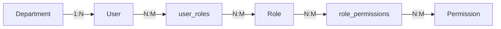

# 社内 AI チャットボット認証機能 要件定義書 (Phase 1.5)

| 項目                | 内容                                                              |
| :------------------ | :---------------------------------------------------------------- |
| **プロジェクト名**  | 社内 AI チャットボット開発プロジェクト (Desktop Intelligence Era) |
| **ドキュメント ID** | REQ-AUTH-001                                                      |
| **バージョン**      | 2.0                                                               |
| **作成日**          | 2026/01/07                                                        |
| **更新日**          | 2026/01/28 (正式認証テーブル仕様反映・RBAC対応)                   |
| **関連ドキュメント** | DES-AUTH-001 (基本設計書), 企業内AIチャットボット基盤における統合ユーザー管理データベースの設計仕様.md |

---

## 1. 開発の目的と背景

### 1.1. 目的

本開発の目的は、AI チャットボットにおいて「個」を確立し、セキュアかつパーソナライズされた体験を提供するための**認証基盤（アカウント機能）**を実装することである。

これまでの「端末（ブラウザ）依存の UUID 自動生成」方式を廃止し、DB に登録された資格情報に基づく認証を導入することで、以下の実現を目指す。

- **セキュリティの向上**: 誰が AI を利用しているかを明確にし、ロールベースアクセス制御（RBAC）によるきめ細かいアクセス制御を可能にする。
- **体験の継続性**: デバイスやブラウザが変わっても、会話履歴や設定（AI の口調、RAG 設定など）を引き継げるようにする。
- **パーソナライズの深化**: ユーザー属性（部署、役割）に応じたプロアクティブな情報提案の基盤を作る。
- **組織ガバナンス**: 組織階層に基づいた情報のフィルタリングと監査を可能にする。

### 1.2. 背景

現在（Phase 1 完了時点）は、PoC としての利用障壁を下げるため、アクセスするだけで自動的に ID が発行される仕組みを採用している。しかし、本番運用（Production）を見据えた場合、以下の課題が顕在化している。

- ブラウザのキャッシュクリアで履歴が消失する。
- 機密性の高いドキュメントを扱う際、ユーザー認証がない状態ではリスクが高い。
- 「思考のパートナー」として信頼関係を築くには、AI がユーザーを個人として認知する必要がある。
- 権限管理が存在せず、全ユーザーが同等の機能にアクセスできてしまう。

## 2. システム概要

### 2.1. コンセプト

**"Entrace to Intelligence" (知性への入り口)**

単なるセキュリティゲート（ログイン画面）ではなく、AI との対話が始まる「期待感を醸成する空間」として設計する。macOS Sequoia の世界観を踏襲し、認証プロセス自体が未来的で心地よい体験となることを目指す。

### 2.2. ターゲットユーザー

- **全社員**: 将来的には数千人規模を想定
- **管理者**: ユーザー管理を行う情報システム部

### 2.3. 利用環境

- **OS**: Windows 10/11 (主力), macOS
- **Browser**: Google Chrome, Microsoft Edge
- **UI Framework**: React (Vite) + Tailwind CSS (macOS Styling)

### 2.4. アーキテクチャ方針 (Decoupled Auth Model + RBAC)

本システムは、ユーザー認証と AI 推論エンジンを疎結合に保つアーキテクチャを採用する。
また、正式仕様に基づき**ロールベースアクセス制御（RBAC）**を中核とした権限管理を導入する。

- **Authentication Layer (Client/DB)**:
  - ユーザーの本人確認（メール/パスワード認証）、アカウント状態検証、およびセッション管理は、React アプリケーションと独自のユーザー DB 間で完結させる。
  - Dify 側にはログイン機能を持たせず、推論 API としてのみ利用する。
- **RBAC (Role-Based Access Control)**:
  - ユーザーには1つまたは複数のロール（役割）を割り当て、ロールには具体的な権限が紐付けられる。
  - 個々のユーザーに直接権限を割り当てるのではなく、ロールを介して権限を管理することで、運用コストとセキュリティリスクを低減する。
- **Identity Mapping (ID 連携)**:
  - 認証成功時に DB から取得した一意な `userId` (User Identifier) を、Dify API 呼び出し時の `user` パラメータとして動的に注入する。
  - これにより、Dify 側では「どのユーザーの会話履歴か」を識別・分離するが、Dify 自体がパスワード等を管理することはない。

## 3. 機能要件 (Functional Requirements)

### 3.1. 認証・アカウント管理 (Auth Core)

| ID             | 機能項目           | 要件詳細                                                                                                                                                                                 | 備考                                                                |
| :------------- | :----------------- | :--------------------------------------------------------------------------------------------------------------------------------------------------------------------------------------- | :------------------------------------------------------------------ |
| **F-AUTH-001** | **ログイン**       | ・メールアドレスとパスワードによる認証を行う。<br>・`account_status` を検証し、有効なユーザーのみログインを許可する（無効・退職ユーザーは拒否）。<br>・認証成功時、RBACを解決し実効権限を含むユーザー情報を取得。<br>・認証成功時、サーバーから発行されたトークンをセキュアに保持する。<br>・認証失敗時、ユーザーフレンドリーなエラーメッセージを表示する。 | 初回はモック DB または Firebase Auth 等を利用想定                   |
| **F-AUTH-002** | **サインアップ**   | ・新規ユーザーアカウントを作成する機能。<br>・必須項目: メールアドレス、パスワード、氏名。<br>・パスワード強度チェック（8 文字以上、英数混在等）を行う。<br>・新規ユーザーにはデフォルトで「一般ユーザー（general）」ロールを割り当てる。 | 社内ツールのため、将来的には SSO 化または管理者招待制への移行を検討 |
| **F-AUTH-003** | **ログアウト**     | ・現在のセッションを破棄し、ログイン画面へ遷移する。<br>・ローカルに保存された機密情報（キャッシュされた会話等）をクリアする。                                                           | サイドバー下部の設定メニュー内に配置                                |
| **F-AUTH-004** | **セッション維持** | ・ブラウザを閉じても、一定期間は再ログイン不要で利用可能とする（永続化）。<br>・セッション復元時にも `account_status` を再検証する。<br>・アクセストークンの有効期限管理を行う。                                                                   |                                                                     |
| **F-AUTH-005** | **パスワード管理** | ・入力時に「目のアイコン」でパスワードの表示/非表示を切り替え可能とする。                                                                                                                |                                                                     |
| **F-AUTH-006** | **権限チェック**   | ・ユーザーの実効権限に基づき、UI要素の表示/非表示を制御する。<br>・管理画面は `admin:access` 権限を持つユーザーのみアクセス可能とする。                                                  | RBAC対応（新規追加）                                                |

### 3.2. ユーザープロファイル (User Profile)

| ID             | 機能項目         | 要件詳細                                                                                                                                            | 備考                                 |
| :------------- | :--------------- | :-------------------------------------------------------------------------------------------------------------------------------------------------- | :----------------------------------- |
| **F-PROF-001** | **基本情報表示** | ・サイドバーおよび設定画面に、ユーザー名、アイコン、所属部署を表示する。<br>・アイコン未設定時は、名前のイニシャルから自動生成する。                          | 現状の「Loading...」表示を実データ化 |
| **F-PROF-002** | **設定同期**     | ・「AI の口調」「テーマ設定(Light/Dark)」などの設定値をアカウントに紐づけて DB 保存する。<br>・ログイン時に DB から設定を取得し、端末間で同期する。 | アーキテクチャ分析に基づく要件追加   |
| **F-PROF-003** | **ロール表示**   | ・ユーザーに割り当てられたロール（管理者、一般ユーザー等）を設定画面に表示する。                                                                    | RBAC対応（新規追加）                 |

## 4. 非機能要件 (Non-Functional Requirements)

### 4.1. UI/UX 要件 (DESIGN_RULE.md 準拠)

本システムのログイン画面は、既存の Web フォームの常識を捨て、ネイティブアプリのような質感を持たせること。

- **Material System (Liquid Glass)**:
  - ログインパネルは `mat-hud` (Blur 50px + Saturate 200%) を採用し、背景が美しく透ける「磨りガラス」表現とする。
  - 背景には `FluidOrbBackground` を配置し、AI の知性を表現する Cyan/Magenta/Yellow/Blue のオーブが緩やかに浮遊すること。
- **Interaction (Spring Physics)**:
  - ログインボタンや入力フィールドのフォーカスアニメーションには Framer Motion (Spring: stiffness 250, damping 25) を適用する。
  - エラー時のシェイクアニメーション等も物理挙動に基づいた動きとする。
- **Typography**:
  - 入力文字は Inter または SF Pro を使用し、可読性を高める。
  - ラベルやプレースホルダーは `var(--color-text-sub)` を使用し、視覚的階層を保つ。
- **アカウント状態エラー**:
  - 無効化・退職済みアカウントでのログイン試行時は、ユーザーフレンドリーなエラーメッセージを表示する。

### 4.2. セキュリティ要件

- **通信の暗号化**: 全ての通信は HTTPS (TLS 1.2 以上、将来的にTLS 1.3) で行う。
- **パスワード保存**: DB 格納時は平文保存を禁止し、ソルト付きハッシュ化（bcrypt/Argon2 等）を行う（モック段階でも意識した設計とする）。
- **XSS/CSRF 対策**: 認証トークンの取り扱いにおいて、XSS 対策（HttpOnly Cookie 推奨だが、SPA 構成上の制約がある場合は LocalStorage 利用時のサニタイズ徹底）を講じる。
- **アカウント状態管理**: 無効化（0）・退職（2）のアカウントはログインを拒否し、既存セッションも無効化する。
- **最小権限の原則**: RBACにより、ユーザーには業務に必要な最小限の権限のみを付与する。

## 5. 開発スコープ (Phase 1.5)

### 5.1. In Scope (今回実装するもの)

- **ログイン画面 (UI)**: `DESIGN_RULE.md` に準拠した React コンポーネントの実装。
- **認証ロジック (Frontend)**: `useAuth` フックの作成、Context API による状態管理、RBACの解決。
- **モック認証サーバー (Service)**: 正式仕様準拠のテーブル構造をエミュレートした非同期関数（遅延実行を含む）。
- **ID マッピング**: アプリ認証 ID (`userId`) を Dify API リクエストの `user` パラメータへ変換・送信するロジック。
- **オンボーディングとの統合**: 初回ログイン時のみオンボーディングを表示するロジックへの改修。
- **権限ベースのUI制御**: `hasPermission` による機能の表示/非表示制御。

### 5.2. Out of Scope (今回は実装しない/Phase 2 以降)

- **SSO (Single Sign-On)**: Azure AD (Entra ID) や Google Workspace との連携。
- **パスワードリセット機能**: メール送信を伴う再設定フロー。
- **多要素認証 (MFA)**: アプリ認証や SMS 認証。
- **管理画面**: 全ユーザーを一覧・削除する管理者用 UI。
- **監査ログ**: 変更履歴の追跡機能。
- **利用メトリクス収集**: トークン消費量等の記録。

## 6. データモデル (DB Schema)

### 6.1. テーブル構成概要

正式仕様「企業内AIチャットボット基盤における統合ユーザー管理データベースの設計仕様」に準拠し、RBACを中心とした以下のテーブル構成を採用する。

| テーブル名 | 説明 | Phase A (Mock) | Phase B (Real) |
|:---|:---|:---|:---|
| `users` | 認証基盤・ユーザー情報 | JS配列 | Cloud SQL for PostgreSQL |
| `roles` | 役割定義 | JS配列 | Cloud SQL for PostgreSQL |
| `permissions` | 権限定義 | JS配列 | Cloud SQL for PostgreSQL |
| `user_roles` | ユーザー-役割マッピング | JS配列 | Cloud SQL for PostgreSQL |
| `role_permissions` | 役割-権限マッピング | JS配列 | Cloud SQL for PostgreSQL |
| `departments` | 組織階層 | JS配列 | Cloud SQL for PostgreSQL |

### 6.2. RBAC（ロールベースアクセス制御）の採用

個々のユーザーに直接権限を割り当てるのではなく、「役割（ロール）」を介して権限を管理することで、運用コストとセキュリティリスクを低減する。



### 6.3. users テーブル（認証基盤）

| カラム名 | データ型 | 制約 | 説明 | 必須 |
|:---|:---|:---|:---|:---|
| `user_id` | `UUID` | `PRIMARY KEY` | ユーザーを一意に識別する内部ID | ○ |
| `employee_code` | `VARCHAR(10)` | `UNIQUE`, `NOT NULL` | 既存の社員番号との紐付け用キー | |
| `email` | `VARCHAR(255)` | `UNIQUE`, `NOT NULL` | 会社用メールアドレス | ○ |
| `password_hash` | `VARCHAR(255)` | `NOT NULL` | bcrypt/Argon2でハッシュ化 | ○ |
| `department_id` | `INT` | `FK (departments.id)` | 組織階層テーブルへの参照 | |
| `account_status` | `TINYINT` | `DEFAULT 1` | 1: 有効, 0: 無効, 2: 退職 | |
| `name` | `VARCHAR(100)` | `NOT NULL` | 社員氏名（フルネーム） | ○ |
| `created_at` | `TIMESTAMP` | `DEFAULT NOW()` | レコード作成日時 | |
| `updated_at` | `TIMESTAMP` | `DEFAULT NOW()` | レコード最終更新日時 | |

### 6.4. roles テーブル（役割定義）

| カラム名 | 型 | 制約 | 説明 |
|:---|:---|:---|:---|
| `id` | `UUID` | `PRIMARY KEY` | ロールID |
| `role_code` | `VARCHAR(50)` | `UNIQUE` | `admin`, `general`, `viewer` 等のコード |
| `name` | `VARCHAR(100)` | `NOT NULL` | ロールの日本語名 |

**初期ロール定義:**

| role_code | name | 説明 |
|:---|:---|:---|
| `admin` | 管理者 | 全権限を持つシステム管理者 |
| `general` | 一般ユーザー | 標準的な業務ユーザー |
| `viewer` | 閲覧専用 | 読み取り専用ユーザー |

### 6.5. permissions テーブル（権限定義）

| カラム名 | 型 | 制約 | 説明 |
|:---|:---|:---|:---|
| `id` | `UUID` | `PRIMARY KEY` | 権限ID |
| `perm_code` | `VARCHAR(50)` | `UNIQUE` | `chat:view_all`, `user:write` 等 |
| `name` | `VARCHAR(100)` | `NOT NULL` | 権限内容の日本語説明 |

**初期権限定義:**

| perm_code | name | 説明 |
|:---|:---|:---|
| `chat:send` | チャット送信 | AIチャットの送信権限 |
| `chat:view_own` | 自分の履歴閲覧 | 自分の会話履歴の閲覧権限 |
| `chat:view_all` | 全履歴閲覧 | 全ユーザーの会話履歴の閲覧権限 |
| `user:read` | ユーザー情報閲覧 | ユーザー情報の閲覧権限 |
| `user:write` | ユーザー情報編集 | ユーザー情報の編集権限 |
| `admin:access` | 管理画面アクセス | 管理画面へのアクセス権限 |
| `knowledge:manage` | ナレッジストア管理 | ナレッジストアの管理権限 |

### 6.6. 中間テーブル

#### user_roles（ユーザー-役割マッピング）

| カラム名 | 型 | 制約 | 説明 |
|:---|:---|:---|:---|
| `user_id` | `UUID` | `PK`, `FK (users.user_id)` | ユーザーID（CASCADE DELETE） |
| `role_id` | `UUID` | `PK`, `FK (roles.id)` | 割り当てる役割のID |
| `assigned_at` | `TIMESTAMP` | `DEFAULT NOW()` | 役割を付与した日時 |

#### role_permissions（役割-権限マッピング）

| カラム名 | 型 | 制約 | 説明 |
|:---|:---|:---|:---|
| `role_id` | `UUID` | `PK`, `FK (roles.id)` | 対象となる役割のID |
| `permission_id` | `UUID` | `PK`, `FK (permissions.id)` | 役割に含まれる権限ID |
| `created_at` | `TIMESTAMP` | `DEFAULT NOW()` | 権限セットを構成した日時 |

### 6.7. departments テーブル（組織階層）

| カラム名 | データ型 | 制約 | 説明 |
|:---|:---|:---|:---|
| `id` | `SERIAL` | `PRIMARY KEY` | 部署を一意に識別するID |
| `name` | `VARCHAR(100)` | `NOT NULL` | 部署名（例：第一営業課） |
| `parent_id` | `INT` | `FK (departments.id)` | 親部署のID（ルート部署はNULL） |
| `org_path` | `LTREE` | | 階層パス（高速な部分木検索用） |

### 6.8. ロールと権限のマッピング例

```
admin（管理者）:
  - chat:send
  - chat:view_own
  - chat:view_all
  - user:read
  - user:write
  - admin:access
  - knowledge:manage

general（一般ユーザー）:
  - chat:send
  - chat:view_own
  - user:read

viewer（閲覧専用）:
  - chat:view_own
```

## 7. アーキテクチャ・データフロー (Flow)

ユーザー認証から AI 応答までのフローを定義する。

```mermaid
graph TD
    User((User))

    subgraph "Client Side (Browser / React)"
        UI[Login UI / App Layout]
        AuthHook[useAuth Hook]
        PermCheck[hasPermission Check]
        Local[LocalStorage (Token)]
    end

    subgraph "Auth & Data Layer (Backend / DB)"
        AuthDB[(User DB)]
        subgraph "Tables"
            UsersTable[users]
            RolesTable[roles]
            PermsTable[permissions]
            UserRolesTable[user_roles]
            RolePermsTable[role_permissions]
        end
    end

    subgraph "AI Core (Dify Cloud)"
        DifyAPI[Dify API Gateway]
        Workflow[Workflow / RAG]
    end

    %% Flow
    User -->|1. Credentials Input| UI
    UI -->|2. Verify| AuthHook
    AuthHook -->|3. Query (by email)| AuthDB
    AuthDB -->|4a. Check account_status| UsersTable
    AuthDB -->|4b. Resolve RBAC| UserRolesTable
    UserRolesTable --> RolesTable
    RolesTable --> RolePermsTable
    RolePermsTable --> PermsTable
    AuthDB --|5. Return UserProfile + Permissions| AuthHook
    AuthHook --|6. Persist Session| Local

    UI -->|7. Check Permission| PermCheck
    PermCheck -.->|8. Show/Hide UI Elements| UI

    UI -->|9. Chat Request (param: user = userId)| DifyAPI
    DifyAPI -->|10. Process (Isolated by userId)| Workflow

    %% Styles
    classDef db fill:#f9f,stroke:#333,stroke-width:2px;
    class AuthDB db;

```

---
